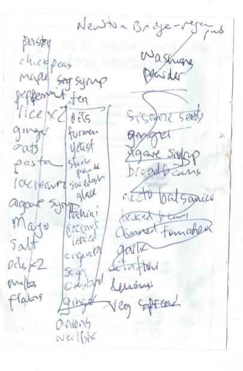

```{r setup2, cache=FALSE, include=FALSE}
library(knitr)
library(tint)
knitr::opts_chunk$set(tidy = FALSE, cache.extra = packageVersion('tint'))
options(htmltools.dir.version = FALSE)
output <- opts_knit$get("rmarkdown.pandoc.to")
opts_chunk$set(warning=FALSE)
opts_chunk$set(message=FALSE)
opts_chunk$set(echo=FALSE)
opts_chunk$set(error=FALSE)
opts_chunk$set(cache=TRUE)
```

# Abstract

We can understand devices such as recommender systems as attempts to transform or convert the temporal and agential fabric of social ordering practices. 
This paper investigates practices of ordering in the setting of shopping lists and  online grocery orders. 
Although all shopping lists mix past and future actions, actual and potential events, and normative and actual values, their re-writing by recommender systems adds a new operational dynamic.
It reconstructs an account of how a recommender system suggests a small number of grocery items of personal relevance to each of the millions of online grocery shoppers in  a major UK supermarket chain. 
The paper explores how the constitutive incompleteness of shopping lists, their propensity to expand or change, becomes more important than their capacity to  enumerate or rank things. 
It argues that the conversion of lists from finite ordering to indeterminate propensity in recommender systems requires new ways of conceptualising social order. 

# Probabilities and propensities: conversion experiences in online grocery shopping 
 
Online grocery shopping at Tesco, a large supermarket chain based in the UK, includes recommendations for further grocery purchases under the title of 'Have you forgotten?'. When Tesco customers shop for groceries online, a list of five recommendations appear at the checkout stage. The recommendations are the product of a recommender system, an important category of operational device in big data (see for instance [@Striphas_2015] for analysis of Netflix recommendation; [@Morris_2015]  or [@Seaver_2015] for an account of music recommendations]).  The question 'have you forgotten?' is followed by a list of some  grocery items that could have been or are usually on a shopping list. The title of the suggestions is a bit misleading: the recommender system, as we will see, is not concerned with forgetting, with the many slips and oversights associated to which shopping is prone,  but rather with items that customers had not selected perhaps because they had never thought of buying them in the first place.

The shelves of large contemporary supermarket are the endpoint of global logistic supply chains, in all their logistical, value-transforming and brand-mediated hypercomplexity (see [@Neilson_2012; @Tsing_2009]).  Groceries imply a planetary geography of agriculture, industry, transport, communication and financialisation animated by flows of labour and capital. Encounters between this hyper-complex commodity-geography and people, even in the familiar confines of a supermarket, are no simple matter, either for shoppers or for supermarket operators such as Tesco. For shoppers, as Daniel Miller has argued [@Miller_2012],  shopping takes place as a negotiation of discrepancies between normative and actual social order (for instance, between ideals of health and commitments to thrift). It can also be seen  as a sacrificial ritual that re-instates social order in various ways. 

The shopping list, whether written on the back of an envelope, or saved as a list in an online grocery shopping system, lies at the intersection of these logistical flows, infrastructural orderings, cultural values and  lively negotiations.  It is an intersectional ordering device that encapsulates a universe of possible references, and a teeming multitude of propensities with an actual local order (in both senses of that term: an ordering and an imperative). As people shop, either by  trawling along aisles packed with thousands of products, or scrolling down screens or searching for particular brands amidst search results, lists inscribe some kind of order that filters or reduces the excessive propensities, claims, dazzle and distraction of commodities to the practicalities of domestic economy.

Hand-written shopping lists undoubtedly have ongoing importance and display interestingly mixed ordering practices (see the montage of handwritten shopping lists at [Grocery List](http://www.grocerylist.org)). But online shopping lists take shape at the intersection of web and internet infrastructures, supply chain logistics, individualised practices and *habitus,* and increasingly, the predictive operations of  recommender systems. Just as the aisles and shelves of a supermarket present a densely-woven semiotics of objects competing for visual attention by offering distinctions of taste, thrift, expedience, novelty, indulgence, health and increasingly, online shopping recommender systems generate lists that seek to align people to commodities that they otherwise might have little relation to (see [@Turow_2015] for an overview).  

```{r random-basket, echo=FALSE, cache=TRUE, fig.cap='Random basket'}
library(dplyr)
library(ggplot2)
library(readr)
library(knitr)
csvs = list.files('data', pattern = '*.csv',full.names=TRUE)
df = bind_rows(sapply(csvs, read_tsv))
kable(sample_n(df, size=5)$name, col.names='item', caption='A random list of Tesco grocery items')
```

```{r shopping-hand, fig.cap='A hand-written shopping list'}

```

The items on Tesco's 'Have You Forgotten?' list are recommendations. They are only a few of them: five. The question is: which five items and in what order? In terms of content, there are many similarities between shopping lists such as Figure \@ref(fig:shopping-hand)  -- a dozen lines scrawled on the back of a used envelope stuck on the refrigerator door  --  and the five ranked items shown to a customer on an online shopping site (as shown in Table \@ref(tab:random-basket)). Even if they are similar in content,  the list of five suggestions shown to Tesco's online customers at the checkout  exemplifies a transformation in forms of ordering. In its re-writing of the list, the recommender system reassembles individualised desire, consumption practices, value-chains, infrastructural time-space dynamics, the lives of others and the propensities of things.   A major contemporary form of ordering, the recommender system can be found in many  forms of news, media, entertainment, marketing, and advertising. Tesco's recommender systems differs greatly from others associated with Amazon, Netflix or Ebay. Grocery shopping is a high-frequency, multi-purchase shopping practice and the potential for recommendations proliferates accordingly. 


Despite being titled 'Have You Forgotten?' Tesco's recommender system  focuses on 'conversion events.' If a shopper does buy a recommended item, 'conversion' has occurred.  From a supermarket perspective, high-value conversion are desirable. There is little value in successfully recommending small or cheap items such as rubber bands or toothpicks. Conversion events, when they occur, confirm the power of predictive analytics to change the world in some way. From a sociological perspective, the significance of conversion events is far less obvious. In the name of conversion events, recommender systems stage an epistemic-operational transformation central to big data. In conversion events,  predictive analytics happens in the world.  The tendency of things to realize certain events -- what Popper terms the 'propensities of things' [@Popper_1990, 11] -- happens  through data practices.   Data in concert with calculation, models, infrastructures, and experiments, affords apprehension, visibility and management of associative propensities in the world.

# Lists and orders

In grocery shopping, conversion events derive from and affect lists. Whether  they write out shopping lists or not, online grocery shoppers interact with commodities through lists.  Lists have long interested historians, anthropologists, sociologists, literary and media theorists as everyday ordering devices. If, as the social anthropologist Jack Goody argued, lists are historically primary as forms of writing [@Goody_1986], and if list-making and its later variants (e.g. tables) precede discursive and narrative writing practices, then we might expect lists to function as powerful social ordering devices. More recent sociological work on lists (see [@deGoede_2016] for an overview) explore the social and political potency of lists as ordering devices. As literary scholars suggest (see [@Mainberger_2003]), even if lists have often been de-valued as literary forms, list-making commonly appears in literary form whenever writing seeks to address, name, group or evoke totality, profusion, excess or abundance. From both  anthropological and literary perspectives, shopping lists have excellent reasons to exist: they are deeply rooted in organisational life and infrastructures. Lists weave together people, infrastructures, things, and places.[^1.456]    

[^1.456]: While lists intersect strongly with other meaning and sense-making practices in everyday life and popular culture, they can be refractory to discourse  and textual analysis methods built around models of language or speech, with its rules of syntax and grammar. On the one hand, lists are highly associative. They can be interpreted or decoded semiotically, although they exhibit  variations in textuality -- how they are written and read -- that thwart semiotic readings. On the other hand, as operational inscriptions, they can be treated ethnomethodologically, as the production of social order in a given setting. We might, in the light of their mutability, permeability and embedding in social order,  approach lists from various theoretical angles -- as asignifying semiotics as Maurizio Lazzarato calls it in his _Signs and Machines_ [@Lazzarato_2014] or as elements in 'a new order of spatio-temporal continuity for forms of economic, political and cultural life' as Celia Lury puts it in her account of topological turn [@Lury_2012].

In this paper, I focus on lists and list-making in terms of the predictive social orderings.   All lists are forms of order. Mathematicians distinguish lists from sets on the basis of order. Formally, both lists and sets are collections, but a list also contains a mapping of its elements to an ordering, usually the natural or counting numbers. Sometimes this order is explicit. Numbers are written down one side of the list. Often the order is implicit to the spatial arrangement of the list.  Mappings between list order and social order are manifestly highly contingent. A flight checklist differs greatly from a personal to-do list, even if they share many formal properties.  Listing practices in a given social setting, therefore, always index an engagement between the formal properties of the list and the necessarily more fluid dynamics of social order. From the perspective of social order, shopping lists, as they are co-constructed by a supermarket chain's recommender system, might be important intersectional zones for the conversion of average everydayness through data-analytic propensities. 

How should we view the predictive re-writing of lists? The media theorist Mark Hansen has recently suggested that 'predictive analytics are discoveries of micrological propensities that are not directly correlated with human understanding and affectivity and that do not by themselves cohere into clearly identifiable events.' [@Hansen_2015a, 111-112] Hansen's account resonates with wider views of big data.  The expectation energising much predictive practice  pivots on 'micrological propensities' elicited from data. Unlike many other accounts of data, Hansen  links data to propensities of things in the world via probabilities:

>Whatever explanatory and causal value predictive analytics of large datasets have is, I suggest, ultimately rooted in this ontological transformation whereby probabilities are understood to be expressions of the actual propensity of things [@Hansen_2015a, 120] 

In his Whitehead-inspired account, Hansen theorises prediction as an 'ontological transformation' that deploys probabilities in an evermore closely woven and encompassing expression of animated, eventful, propensities of things. Predictive analytics links probabilities as calculations to propensities or the mutable associative agencies of things. The practical and indeed empirical  question is whether such transformations or 'conversion' in relations between probabilities and 'the propensities of things'  can be detected and articulated in the prosaic setting of shopping lists and recommender systems.[^20.1]

[^20.1]: I will argue that 'conversion' is a preferable term for these changes.  It highlights  re-orientations in subjects, experience, things, numbers and structures that ranges more widely than Hansen's 'ontological transformation' formulation.

# Conversion events: DunnHumby's work for Tesco

At one of the many industry-meets-academia events occurring in increasingly data science-oriented higher education institutions in the UK, speakers from industry, government and commerce described their work with predictive models.[^11.1] Shreena Patel, a PhD graduate in statistics and operations research,  works as a data scientist for DunnHumby, a well-known [ customer science company ](https://www.dunnhumby.com/) [@dunnhumby_2017].  Her work at DunnHumby focuses on online grocery shopping at the supermarket chain Tesco.  Speaking to an audience of statisticians and operations researchers, Patel focused on the development and operation of predictive models underlying  shopping list recommendations. Her presentation was filled with graphs, numbers, and tables concerning ongoing development of the 'Have you forgotten?' recommender system. 

[^11.1]: More than 100  Data Science Institutes have been set up in North America, Europe and UK since around 2012. The traffic between higher education and data analytics in industry is intense and flows in several forms: people funding, research findings, software and technical devices (code) and training. 

```{r simulate-inventory, echo=FALSE, cache=TRUE, fig.margin=TRUE, fig.cap='Prices and quantities of things in the Tesco universe of reference'}
library(dplyr)
library(ggplot2)
library(readr)
library(knitr)

csvs = list.files('data', pattern = '*.csv',full.names=TRUE)
df = bind_rows(sapply(csvs, read_tsv))

g = ggplot(df, aes(x=price,y=ContentsQuantity)) + geom_point(alpha=0.3, size=0.9 ) + theme(axis.text=element_text(size=10))  + xlab('Price (£)')
g + ylab('Number of products') + scale_x_log10() + geom_smooth()
```

```{r expensive-groceries, echo=FALSE, cache=TRUE}
s = sample_n(df[df$price>=30,], size=10)
s$Price = s$price
s$Label = s$name
kable(s[order(s$price), c('Label','Price')], col.names=c('Item', 'Price (£)'), caption='Random sample of higher cost items from Tesco')
```

Like many recommender systems, Patel's models address a large inventory of commodities.  Figure \@ref(fig:simulate-inventory) plots something of the density of commodity prices in the Tesco grocery inventory. By virtue of their sheer abundance, the plot cannot easily separate the many items that Tesco sells, especially in the price range £1-£10. A random sample of the more highly priced items in Tesco stores is shown in Table  \@ref(tab:expensive-groceries)      

Against the background of the sheer number of commodities and their distribution of prices,  Patel's presentation presents two opportunities. First, by recounting, contextualising and commenting on the main steps in making the 'Have your forgotten?' list, we might follow some of the predictive sense-making done by data scientists and customer analytics teams working with transactional data in a typical commercial setting. Patel mentioned many of these steps only fleetingly in the presentation, for they are largely taken for granted as part of predictive analytic practice. Second, Patel focused on the renovation and updating of long-standing data-mining practice via a much more explicitly 'big data' and 'machine learning' oriented implementation.  What stands out from the presentation is the normality of the recommender system: it is part of a long-standing and ongoing transformation or conversion of grocery shopping. From a sociological standpoint, the interest lies less in specific technical innovations and more on how the ordering work done by recommender systems relates to problems of social order more generally. 

Since Patel was not able to release her presentation slides to a wider audience, I rely on data-driven simulations and statistical programming as ways of reconstructing elements of the recommender system. In order to explore the operational environment she described, and its predictive operations, I model key features of her presentation using sample grocery data drawn from the Tesco API ([Application Programmer Interface](https://devportal.tescolabs.com/docs/services/56c73b1bf205fd0ed81dbe7a/operations/56d5b2bee2813e0a0053c47c), [@Tesco.com_2017])   and a range of data science, statistics and graphics libraries implemented in the widely-used statistical programming language `R` [@RDevelopmentCoreTeam_2010]. At a methodological level, it draws heavily on the vision of 'interface methods' proposed by Noortje Marres [@Marres_2015] in order to keep in view both the highly technical orderings of lists in recommender system and the changes in social orderings they might imply or impel.

# How the shopping list was reconstituted in the 1990s

The main narrative of Patel's presentation concerned a shift from a well-established loyalty-card based data-mining model to a predictive, probabilistic, personally relevant re-writing of the shopping list in almost-realtime. The changes Patel described are increasingly widespread and common. While they are configured in Tesco-specific ways by DunnHumby (and this reflects a longer history), they are also broadly typical. Tesco is the largest supermarket chain in UK, famous amongst retailers for its  customer loyalty and targeted marketing programme known as 'Tesco  Clubcard,' which started in 1991. DunnHumby -- founded by operations researchers Edwina Dunn and Clive Humby -- is said to have convinced the CEO of Tesco sometime in 1991 that a loyalty card program could change the supermarket chain's relationship to its customers.  Clive Humby's academic publications  are hard to track down, but an early paper given at the _Conference of Young Operational Researchers_ in Nottingham in 1984 suggests the direction that he, DunnHumby and later Tesco would take in constructing lists [@OKeefe_1984]. The abstract for Humby's presentation pre-figures an ongoing trajectory for data mining techniques aimed at eliciting detailed information on individual customer preferences.   

```{r humby-1984, fig.cap = 'Abstract from a Clive Humby presentation (Humby,1984)'}
include_graphics('figure/2_humby_young_org_1994.png')
```

While Tesco  succeeded in data-mining its customers using demographic segmentation,  and perhaps became the UK's biggest supermarket with the help of data-mining in the 1990s, the shopping environment  in 2017 is markedly different [@Turow_2017]. It is no longer organised around campaigns involving special offers or redemption of points for demographically segmented loyal customers (DunnHumby made heavy use of UK Census data). It can no longer rely on placement of goods in carefully chosen locations in stores. It needs or at least might want to continuously up-sell and cross-sell to customers who might hardly ever visits the supermarket itself. 

How could we characterise the shift from ClubCard data mining to online grocery markets?  If 'Tesco is the clear winner in the online grocery market, in fact it takes almost 50p of every £1 spent on food shopping on the internet' [How SEO helps Tesco to dominate the online grocery market](https://econsultancy.com/blog/64841-how-seo-helps-tesco-to-dominate-the-online-grocery-market)[@Silverwood-Cope_2014], then Tesco itself has undergone some kind of conversion? Patel described her work at DunnHumby as shifting the recommender system from a 'rules-based list' to a 'relevancy model.' The relevancy model changed how the 'Have You Forgotten' list was constructed.   This shift is a typical of broader re-organisation of prediction in which existing data analysis practices are being re-distributed and intensified in particular ways. The shift in models results in a more probabilistic structuring of lists.  The ostensible banality of the 'Have you forgotten?' recommendations betrays micrological signs of a topologically complex predictive infrastructure that constructs alignments between people and things in significant ways. 

# Reconfiguring recommendations

Academic researchers first began writing about recommender systems in the mid-1990s. From the outset they highlighted a potential shift from demographic-driven market research or data mining techniques to personalized recommendations. For instance, writing in 1997 in a special section of the _Communications of the ACM_ on recommender systems, Paul Resnick and Hal Varian (at that time Dean of Information Sciences at UC Berkeley, but currently Chief Economist at Google), made much of this personalisation [@Resnick_1997]. Resnick and Varian  emphasise the need to distinguish the emerging practices from data mining: 

> In everyday life, we rely on recommendations from other people. ... Recommender systems augment this natural social process. In a typical recommender  system, people provide recommendations as inputs, which the system then aggregates and directs to appropriate recipients. In some cases the primary transformation is in the aggregation; in others the system’s value lies in its ability to make good matches between the recommenders and those seeking recommendations.[@Resnick_1997,56] 

Writing just after the advent of web-based e-Commerce, Resnick and Varian  imagined recommender systems augmenting the 'collaborative filtering' that people do when they write and read reviews of products and services (for instance, on the travel website, TripAdvisor; [@Scott_2012]). In 1997,  Resnick and Varian thought that 'people provide recommendations' and recommender systems would aggregate and rank for recipients. A slightly later review, [@Schafer_2001], diagrams an augmented 'natural social process' with a range of elements, technologies, inputs and outputs, with varying degrees of personalization. 

The conversion of  collaborative filtering into predictive personalisation appeared in Patel's presentations. Patel describes the move from 'a rules-based system'  to  a 'personal relevance model'. Each term in that phrase -- personal, relevance and model -- has some weight in the conversion event. We can assume that what Patel describes as  the 'rule-based system' refers  to the `apriori` algorithm, developed  by Rakesh Agrawal and Ramakrishnan Srikanti at IBM Research Alameda in the early 1990s [@Agrawal_1994]. A now-classic approach to 'market basket analysis,' it was listed as one of the top ten data mining algorithms in a survey conducted amongst data miners [@Wu_2008] and usually attracts a chapter in data-mining and machine learning textbooks (e.g. [@Hastie_2009]). 


```{r arules-ex, cache=TRUE, fig.cap='Frequency of association betwene items in the `Grocery` dataset', message=FALSE, echo=FALSE, fig.margin=TRUE}
library(knitr)
library(arules)
library(arulesViz)
library(datasets)
data(Groceries)
itemFrequencyPlot(Groceries,topN=10,col=rainbow(10), ntype="absolute",  cex.axis = 0.55)
```

```{r arules-ex2}
options(digits=2)
rules<- apriori(data=Groceries, parameter=list(supp=0.001,conf = 0.15,minlen=2), appearance = list(default="rhs",lhs="whole milk"), control = list(verbose=FALSE))
rules_sorted <- sort(rules, decreasing=TRUE,by="confidence")
kable(inspect(rules_sorted[1:5]), caption='The first five association rules for the `Groceries` dataset')
```

The `apriori` algorithm finds sets of items that commonly occur together in transactions.  These commonly occurring sets are expressed as 'association rules.' For instance, using the `Groceries` dataset in the `R` package `arules,` we can readily see how Walmart *might* have discovered   the fabled association between diapers and beer.[^149.1] Figure \@ref(fig:arules-ex) shows how often common items appear. `Whole milk` appears most frequently.  The association rule-based model for the `Groceries` dataset illustrates some characteristic ordering practices of 1990s-style data-mining approaches to lists (the `Groceries` dataset  was acquired from a 'local German supermarket' [@Hahsler_2006a]). The association between items is expressed in the form of _rules_ not a model. These rules, a term derived from older decision support literature, define sets of associations between items. Table \@ref(tab:arules-ex2) shows that the first rule has a stronger association than the second. Milk and vegetables is more likely an association than milk and buns.  A rules-based recommender system should, therefore, might put them in that order in the 'Have You Forgotten' list. 

[^149.1]: One of the founding narratives of big data customer analytics, the beer-diaper association was not, according to [@Power_2002] found through data mining at all.

Although association rules and the `apriori` algorithm present social order in terms of sets of frequency-weighted associations, an `apriori`-based recommender system contains no statistical model. It also no grasp on personal relevance since the associations it defines are only between things. Put in terms of the big data conversion, the rules-based system is not predictive, or personal. The `apriori` algorithm might be seen as an attempt to grasp the excess of things in a Tesco supermarket by identifying subsets whose closure derives from the associations between things that people construct (through buying habits, by virtue of a shopping list, etc.). In association rules, personhood or experience is irrelevant. The openness of these rules -- the `apriori` algorithm can product any number of rules of diminishing strength -- points towards the propensity of things to find themselves together in shopping baskets, but cannot cannot individuate that propensity beyond demographic quantiles and categories. 

Even if `apriori`  elicits associations between things, it struggles with the propensity of commodities to multiply. A simple illustration of the combinatorial problem faced by recommender system can be developed using the `Grocery` dataset.  If we take all the items in the `Grocery` dataset and paste them into the 'shopping list' box on the Tesco grocery website (or as I side, run them as searches on the TescoLab Product API), each of the 169 items in the dataset yields dozens and sometimes thousands of products from Tesco online.

```{r tesco-ex, echo=FALSE, cache=TRUE, fig.cap ='Tesco surplus',  fig.margin=TRUE}
    library(ggplot2)
    tesco = read.csv('data/reference_data/tesco_groceries.csv')
    total = sum(tesco$actual, na.rm=TRUE) 
    tesco = na.omit(tesco)
    tesco$actual = as.integer(tesco$actual)
    ggplot(tesco[tesco$actual>50,], aes(x=labels, y=actual, fill=labels)) +geom_bar(stat='identity') + coord_flip() + ggtitle('Tesco grocery items with more than 50 products') + theme(legend.position="none", axis.text=element_text(size=7))
```

Items in the `Groceries` dataset proliferate into a Tesco's list of branded variations. The 169 items of the `Groceries` dataset  expand into roughly `r total` Tesco items (see Figure \@ref(fig:tesco-ex)).  There is, I would suggest, a logistic propensity in things that recommender systems encounter in the ways of global supply chains. The multiple listed  in the `Grocery` dataset becomes more open in this setting through new impersonal intersections that must be bounded and ordered. The proliferation of things on the shelves of supermarket or grocery warehouse confronts produces a combinatorial problem for data miners. `r total` products (actually Patel mentioned 200,000 products) can be combined in a vast number of ways. If a typical shopping list has 20 items, then there are `r format(choose(total, 20), 2)` possible lists. Some of this vast number of possible shopping lists are highly unlikely in terms of typical purchasing patterns, but potentially valuable as recommendations. 

# Ordering relevance through personhood or thinghood?

Combinatorial surplus, however, does not exhaust what might be found in the data. The relevancy model that DunnHumby implemented for Tesco (as for so many other  businesses) seeks to balance the tensions between proliferating associations and relative closure. It responds to the problem of finding an ordering in which the propensities of things as commodities and the propensities of people mingle with each other, without overflowing  the site of their  ordering encounter, the list.[^181.1] Big data discourse in its promissory mode  attributes potency to personalization: 'most important, using big data we hope to identify specific individuals rather than groups' [@Mayer-Schonberger_2013]. As Turow and co-authors conclude in their account of transformation of retail space: 'through it all, knowingly and not, and away from the spotlights of fierce social debate, retailers are encouraging daily routines that accept data-driven personalization as a centrifugal public force' [@Turow_2015, 476]. 

Mark Hansen offers a different perspective on what might happen in these ordering encounters. Hansen attributes 'real potential' to data. Hansen attributes an associative propensity to data:

> [S]urrounding any delimited predictive system is a larger field of data -- what I elsewhere call a “surplus of sensibility” -- that, viewed speculatively, indexes the causal efficacy of the total situation within which this delimited system operates. (Effectively, the latter gains its reliability from closing off this larger surplus of sensibility, thereby transforming an always excessive propensity into a [provisionally] closed dataset.) Because it affords data that exceed whatever any given predictive system might include, the data of the world’s causal efficacy -- the data constituting its real potentiality -- always and in principle facilitates knowledge that cannot be restricted to any particular agenda [@Hansen_2015a, 126-7].

Many affirmative and critical analyses of big data and predictive analytics highlight the divisive social orderings implemented through personalization. For good reason, they attend to changes in personhood.  Hansen, by contrast, seeks to conceive of the potential of data to support or provoke different relations to the world. Even if the underlying contrast between an open world and a 'provisionally closed dataset' limits the account in ways that I will explore, the ontological transformation  Hansen describes  involves people, commodity-things, and infrastructures. The recommender system generates common codings for  the associative propensities of things, the logistical value-chains of supermarket commerce and  the forms of personhood associated with shopping. A model of personhood based on purchase data delimits the propensities of things. 

[^181.1]: Rather than seeing predictive analytics as a closed form of an open world, I am suggesting that we might begin to locate it in the joint effectuations or intersections within models.

If we think of the  new model that Patel describes as the delimited (or delimiting?) system within   the larger surplus of sensibility, how would the idea of a predictive system as a provisional enclosure of the world's causal efficacy, its 'surplus of sensibility' (a terms that carries some connotations of the critical political economy of surplus value) help us understand what the 'Have you forgotten?' recommendations do? It enables us to understand -- as we will see next -- what the Tesco relevancy model borrows from the world. By contrast, despite its ontological ambitions, it limits our understanding of how predictive analytics  themselves exist amidst technical ensembles whose operation remains obscure yet central to contemporary worlds.   

```{r models, fig.cap='Precision measurements for different machine learning models'}
include_graphics('figure/patel_compares_models.png')
```

Patel described the data that Tesco keeps on grocery purchases: 'We have 52 weeks of purchase data for each customer.' These transformations have been widely discussed in the context of big data, where questions of who has how much data are usually most prominent (see [@Kitchin_2014]). In terms of the ways that lists order the world, the amount of data is not perhaps not so important as the way in which list-making is re-ordered via a model of personhood. Patel introduced the new relevancy model with a graph familiar to machine learners and statistical modellers. (A sketch of her graph appears in Figure \@ref(fig:models).)  The graph plots the _precision_ -- the proportion of the recommended products that customers actually purchase -- for several different models. In Hansen's media theoretical terms, the graph indexes the 'causal efficacy' of the recommender system, its capacity to include and transform propensities or 'real potentialities' into operational knowledge.   The graph compares the old rule-based recommender systems with some of the relevancy-model alternatives -- logistic regression, random forests, and a few others -- in terms of their predictions and how those predictions turned out. Patel dismissed most of the models quite quickly and focused only on one, the logistic regression model, which did better than other alternatives. Why did she say little about the model, which after all, produces the probabilistic predictions on which everything in the recommendation list depends and hence the conversion experience? Her interest lay in the precision of the recommendations, and, crucially for our purposes, in how 'most of the gain comes from thinking of good features.'

The models Patel so briefly mentioned are all classifiers, predictive models that spatially order  variables in a dataset as a high dimensional vector space. Operating in the vector space, models classify people and events. Much of the operational formation of the classifier models received scant reference in Patel's presentation. It is likely that in DunnHumby's models the classifying model at the heart of the recommender system constructs a decision boundary in vector space between points that belong to different classes of things [@Mackenzie_2015e]. The classes of things are binary: `recommended` or `not recommended,` and for many of the models shown in the graph, membership of a class is expressed as a probability.  The logistic regression model generates probabilities for each product for each customer. Patel did not articulate the implication of the contrast between the left and right hand side of the graphic. Although the statistical framing appears explicitly (e.g. in measuring the precision of  recommender systems), the underlying shift to a statistical model is barely mentioned. In becoming predictive, the 'Have You Forgotten?' recommendations have included a version of the social in the form of a  model that seeks to identify relations between variables.  The relevance of recommendations pivots on the apprehension of social order by a model. 


# Sparsity: output 20 recommendations from 200,000 products

Note that neither the data analytic infrastructure that processes  Tesco customer data  - Patel will mention `Hadoop` -- nor the predictive analytic device -- the logistic regression model -- loom very large in the conversion of the recommender system. 'Most of the gain comes,' Patel observes, 'from thinking of good features.' While this is almost a truism in big data practice (see, for instance, [@Domingos_2012]), what counts as a good feature in a shopping list? 

Rather than a surplus of sensibility, predictive models often encounter a dearth of sensibility in the data. A  very brief comment from Patel -- 'we have lots of zeros' -- points to the difficult terrain of  'good feature' thinking: the vast, nearly empty matrix of customer-product associations. Given that most things in Tesco remain relatively unknown to each other and to customers. A matrix that records associations between individual people and different products is bound to be mostly empty. Say Tesco has 1 million online customers. Each online  shopper has bought some selection of the 200,000 products. The customer-product data matrix will be `r format(1e6 * 2e5)` in size.  The product-customer matrix, the basic vector-space in which all recommender systems operate, remains very sparse and unpopulated. Given that any one customer is likely to only have bought 100 or so different products, the probability matrix will be close to `r format(100-(100/2e5)*100, 2)`% empty. The data is, as Patel put it, 'massively unbalanced' (any dataset where the items of interest are much rarer than some normal values is said to be unbalanced) and such imbalance would heavily bias the recommender system towards common and only impersonally relevant suggestions, suggestions that might  not produce the desired conversion experience. 

```{r sparsity-ex, echo=FALSE, cache=TRUE, fig.margin=FALSE, fig.cap ='Sparsity of the customer-product association matrix' }
library(ggplot2)
library(reshape2)
p = as.logical(rbinom(n=2e5, size=20,0.001 ))
m = (matrix(p, nrow=1000, byrow=TRUE))
melted <- melt(m)
melted$value <- as.logical(melted$value)
ggplot(melted, aes(x = Var2, y = Var1, fill = value)) + geom_tile() +
    scale_fill_manual(values = c("grey", "red")) + xlab('Customer id') + ylab('Product id') + theme(legend.position='none')
```

Since so many people buy milk, the recommendation system might end up always recommending milk products. So the data needs to be 'corrected' by, as Patel reports, removing -- under-sampling -- some of the data for common purchases.   Secondly, even if a recommendation system finds uncommon items that are good recommendations, they should neither be too cheap ('low spend'), nor, as we will see too similar to what the customer has already ordered.

Given this imbalance, distortion and deficit of sensibility in the data, 'thinking of good features' -- ways of traversing the data -- becomes central. For our purposes, the exact details of these features matter less than attending to the way in which, contrary to Hansen's account of analytic closure,  probabilities become propensities in data practice. The dataset, as we will see, will not be practically treated as 'closed,' as Hansen puts it. Although it undergoes acts of enclosure (for instance, in the transformation of the customer-product matrix into vector space), these acts are not conclusive. 'Thinking of good features' potentially re-opens the dataset and sometimes completely transforms it. This transmogrification, which I suggest occurs mostly in quite obscure yet central zones of data practice, is highly mixed. It combines experimental techniques, infrastructural dynamics, seasonal and daily temporalities, and above all, an ongoing engagement with probabilities and their fungibilities. 

# Experimental settings: A/B allocation and uplift

|Test A|Test B|
|---|---|
|Control A|Control B|

For instance, the predictions of the recommender system themselves are the subject of probabilistic treatment. Patel described the experimental deployment of  the relevancy model experimentally in a random A/B controlled trial on the Tesco website. All customers were  allocated to one of four categories as shown in the table. In the  A/B trial,  an identical shopping list, or even the same person, might receive different recommendations.   The randomised application of the model, drawing on protocols for randomised clinical trials first developed in the 1960s, is widely used in social media platforms and hence in the implementation and observation of the effects of recommender systems.[^238.1] Random allocation of customers to the four categories (Test A, Test B, Control A, Control B) adds a layer of probability to the recommender system in the name of statistical validation of the effects or the 'uplift' of the model.[^122] Ironically,  the effects of a predictive model cannot be known in advance. They can only be observed experimentally. 

[^238.1]: It is difficult to gauge how much. Facebook reports that it has more than 1 million models operating in its infrastructure. [@Dunn_2016] 

It is perhaps significant that this random allocation of customers to control and test groups occurs without any relation to the particular profile or propensities of the customer. It seeks to statistically validate the effects -- the *uplift* -- of the model on  conversion events by allowing the effects of the model on what people do to be measured. The uplift refers to conversion events associated with the same groups of people. Effectively an experiment in inhabiting two different worlds, the randomised control trial  sets up a feedback look between the predictive model (the logistic regression), and the world. 

[^122]: See [@Lo_2002] for an introduction to the construction of experimental set ups for uplift models. Market researchers and data miners seem to have started adopting a statistically grounded experimental predictive practice sometimes around 2000. See for instance [@Almquist_2001]  Response modelling, 'propensity' modelling and uplift modelling all seek to identify associations between 'treatments' or interventions and the 'Responders', the people  affected by the treatment.  

# Infrastructure: the realtime engine serves 

A second layer of probability affects the operation of the recommender system. Much discussion of recent media has highlighted its real-time operation (see [@Kittler_1993; @Virilio_1997; @Hansen_2015; @Bollmer_2016]). Patel's description of the relevancy model infrastructure sketched a different temporal patterning, suggesting immediacy in relation to shopping, but scheduling and periodicity in relation to the infrastructural operations of the predictive model. While raw data from Tesco Online feeds into the model every hour, a recommendation list for each customer is only generated once a week. Customers only shop online every few days at the most, and in some cases, only every few weeks. To continually update the top 200 recommendations for every customer would be computationally expensive.   

A customer does not see their 200 weekly recommendations. The recommender system generates recommendations, but after 'applying business rules, only five are  shown on the Tesco Online website. Patel briefly mentioned  specific infrastructural elements such as `hadoop` [@ApacheSoftwareFoundation_2009]. The logistics of running a predictive model affect listing practices.  The possibility of adjusting the recommendations for every customer weekly derives from an infrastructure capable of collecting data, assimilating that data to a predictive model able to generate approximately 200 million relevant recommendations, where 'relevance' depends on a matrix of probabilities of associations between people and things that shifts in time. Like the global supply chain logistics optimised for flow of commodities [@Tsing_2009; @Neilson_2012], `hadoop` and its legion of variants (`mahout`, `spark`, `hive`, `pig`, `yarn`) operationalise flows of data at an infrastructural rather than analytic scale. In many respects, the quickly glossed-over infrastructural deployment of DunnHumby's relevancy model is the primary conversion event: the logistic regression model at the heart of the recommender system is no longer an analytical device but an operational one. 

# Similarity, substitution, complementarity and micrological propensities

There is more to probabilities in prediction than a simply enclosure and quantification of the surplus of sensibility, the overwhelming variety, differences and noise of the world. I am suggesting, contrary to Hansen, that the propensities of things are enclosed as  probabilities in predictive analytics only to the extent that probabilities themselves become propensities. Recommendations are relevant in a recommender system or any other operational predictive model to the precise extent of their probability. Relevance is closely connected to propensities in the predictive condition. From DunnHumby's standpoint, the relevance of a recommendation relates directly to conversion events. Conversion events happen in the world.  When a recommender system discovers a common coding of human practice, and logistical configurations, with all their value differentiations, they actualise a propensity that hitherto remained potential. From the standpoint of the ontological exchangeability between probability and propensity,  prediction stems from the propensities of things, what Hansen describes as the 'complex and diffuse calculus' that only provisionally congeals as a conversion event. The 'micrological propensities' of things support the relevance of recommendations. 

How does the DunnHumby model deal with the exchange and oscillation between propensities and probabilities? In her presentation, Patel  spent much time addressing the problem of 'basket similarity,' the problem that the recommender system might recommend, for good reason, something similar to items already in a customer's basket. The recommender system or statistical model needs to know how things are related to each other so that it does not waste recommendations on overly similar items. A customer might be willing to substitute a similar item for something they have already chosen, but they are more likely to accept a recommendation for an item that complements items in their list. 

Whereas the association rule-based recommender system focused on thing-thing complementarities -- if you buy bread, you might want milk, if you buy beer, you might want diapers -- the personal relevance substitutions look for micrological propensities that relate to gradations of preference, and variations in time and place.  Micrological propensities in the list relate to a particular time and place, amidst a continuously differentiable pathways between things.

How could the recommender system sense the possible substitutions and complementaries between things for a given customer, especially since a person's sensibilities and susceptibilities concerning groceries might be shaped by wider social groups, orderings and circumstances?  Patel's comments on this were very brief but suggest that the 'Have You Forgotten?' list becomes an increasingly mutable entity, open to many substitutions and intensive re-writings.

Like the mention of `hadoop`, what Patel said about substitution and complementarity draws on extensive but relatively well-established data practices in machine learning. She mentioned,  for instance,  a 'design matrix of 14,000 columns' and the use of '`L1 regularization` to drive coefficients down to zero' in a new feature of the model called 'self-learning substitutes,' a model that examines the recommendation list and predicts substitutes and complementarities for 'all products' in the list. The 'self learning substitutes' feature of the relevancy model draws on another data matrix, the product similarity matrix, itself generated from all previous recommendations that have led to conversion events (that is, 'a user clicked as the response'). A customer's recommendation list might already include `Tesco Ginger Nuts 300g.`   The 'self-learning substitution model' seeks to replace list items with similar but higher value items: `Mcvitie's Ginger Moments 400g.` What is being modelled here? No longer whether to recommend a product to a customer or not, but micrological conversions. 

Similarly, modelling complementarities between things for a particular person entails a matrix of comparisons. `Nutella` complements `bananas,` but the converse is not necessarily true since `bananas` need not complement `nutella,` especially if I have nut allergies.  From the standpoint of customer data science, Patel emphasised the operational significance of predicting complementarities:  'complementarity drives conversion.' Bringing the matrix of similarities expressed as numerical associations between products into the model improves the conversion of recommendations into purchases. From the standpoint of a sociological account of social ordering that associate people and things through propensities, complementarities pose a different problem: what does it mean for social order if the relations between things shift in accordance with our experience of the world as rendered in the intricately varying weights of an L1-regularized logistic regression model? In the similarity matrix, shaped by the history of past recommendations and purchases made by this customer, the propensities of things drive down the surplus of sensibility associated with what people want.

# Conclusion
 
In their mundane intersectional practices of ordering, recommender systems show how  predictive practices affect existing forms of social order in the world. Rather than directly positing an ontological transformation (as Hansen does), or pointing to the erosion of social order (as Turow does), I have explored some of the conversion events associated with a shift from a data-mining rule-based system to a predictive recommender system. The DunnHumby model and the Tesco 'Have You Forgotten?' recommendations present many of the traits of the conversion processes associated with big data. Rather than discontinuous changes, the conversion of the recommender system via a relevance model suggests an ongoing problematization of propensities. We have seen several types of conversion events: ongoing transformation of models and infrastructures, the experimentalisation  of recommendations, and the broader diffusion of a calculus of probabilities into a fibrous weave of propensities and conditionalities, warping over time. The predictive assemblages connect logistical ensembles to the negotiation, compromises, rituals and local orderings of everyday life.

I have been suggesting that predictive listing in the form of open-ended recommendation changes social order. It establishes a common coding between machinic and ritual repetition (as exemplified in the shopping list).  It also suggests some ways in which repetition or reiteration  can also participate in changing and emergent order. By understanding the world in terms of propensities, we have a chance  to engage with contemporary predictive processes in ways that both acknowledge their relentless and exhausting pressure to consume more and retain some chance of inhabiting the world differently. 

Rather than understanding prediction as the closed form of an ontologically open world ('the propensities of things'), the DunnHumby relevance model, in all its statistical, infrastructural, organisational and banal complexity, suggests that the predictive conversion remains constitutively incomplete. Shopping lists in all their banal yet primary orderings are fertile terrain for prediction because they are incomplete, somewhat open and mutable forms.  The constitutive incompleteness and openness of lists are very closely entangled with ongoing processes of ordering and othering, and at the same time, can accommodate predictive operations.   Lists undergoing a 'conversion' experience as they become more probabilistic, but their heterogeneous character as operations caught up in models, infrastructures, experiments, and the flow of commodities means that they can never form a closed set or dataset. The problem of 'constructing good features,' a problem that any predictive model must address, persists as the site of experiments in partly open structures.

A constitutive openness to new associations, new combinations, new groupings or actors is integral to the conversion events associated with contemporary data practice. In their account of the Netflix recommender system, Ted Hallinan and Peter Striphas make the following argument:

> These systems, and more importantly their algorithms, play a critical role in deciding which articles (or parts thereof) gain admission to the cultural realm, and in what form. Their doing so thus points in the direction of another universe of reference—a court of algorithmic appeal in which objects, ideas, and practices are heard, cross-examined, and judged independently, in part, of human beings [@Hallinan_2014, 13]

Despite the somewhat troubling reference to 'another universe,' as if Netflix or DunnHumby's recommender systems occupy a different reality, Hallinan and Striphas usefully and aptly highlight how such systems  mingle  objects, ideas and practices.

Something similar happens to shopping in the Dunnhumby relevance model. In the customer-product association matrix, in the product-product similarity matrix, in the 14,000 variables included in the logistic regression model, a 'universe of reference' takes shape. The shopping list, the commonplace inscription of normative and actual social order, takes on a complex temporal-material structure that mixes prediction, infrastructural constraints, the individual characteristics of list-makers, statistical validations, database architectures and above all the surplus sensibility associated with  circulation and consumption of commodities. Shopping lists undergoing a conversion experience as they become more probabilistic, but the idea that probabilities are the closed form of propensities does not account for the distribution of probabilities in relations between things, between people, between people and things, and between things and people.

# References

