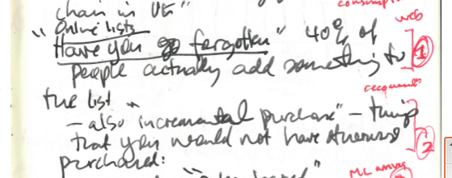
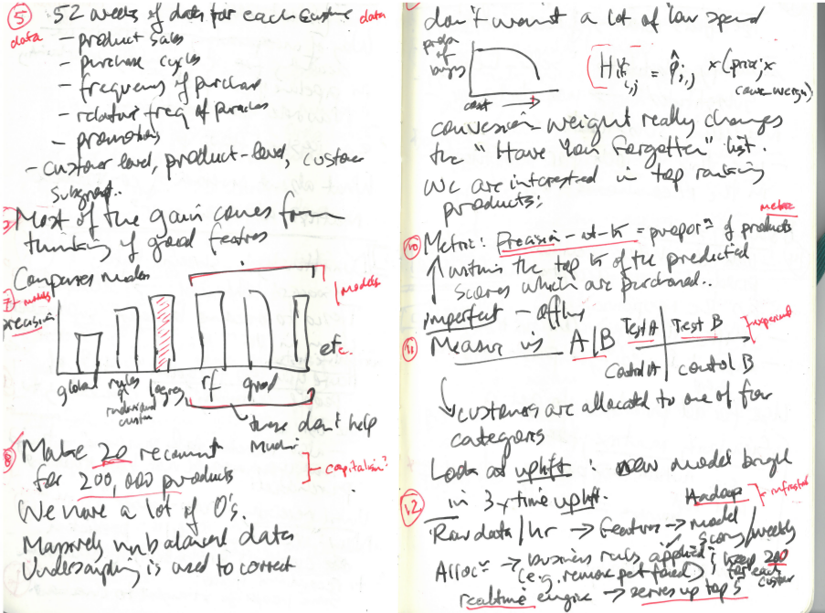
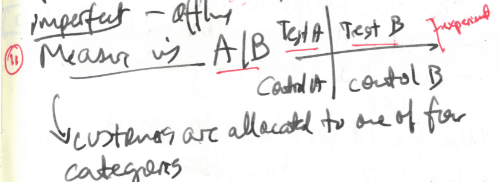
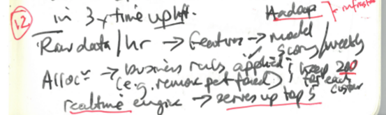
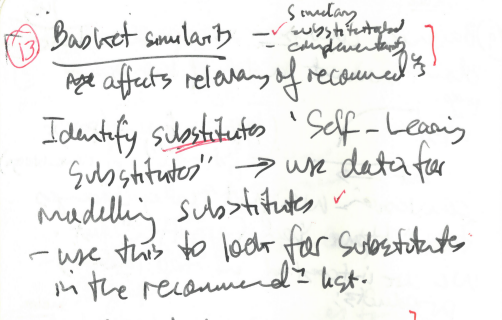

# 'Have you forgotten?' Conversion experiences in list worlds

```{r setup, cache=FALSE, include=FALSE}
library(knitr)
output <- opts_knit$get("rmarkdown.pandoc.to")
opts_chunk$set(warning=FALSE)
opts_chunk$set(message=FALSE)
opts_chunk$set(error=TRUE)
```

## Introduction: the presentation of a presentation
 
I saw recently a presentation about online grocery shopping at Tesco, a large supermarket chain based in the UK. The lists in this setting are recommendations for further grocery purchases under the title of 'Have you forgotten?'. When you shop for groceries online, a list of 'Have you forgotten' recommendations appear  at the checkout stage. While the title 'have you forgotten' implies that you will be shown items that could have been or are usually on a shopping list, the working assumption is a temporal one -- the list is incomplete either because you have forgotten to list something, or you didn't know what should be on your list, perhaps because you have never even thought of putting that thing on your list.

The items on this list are recommendations. They are only a few of them: five. The question: which five items and in what order?


Shopping lists are quite prosaic -- a dozen lines scrawled on the back of a used envelope stuck on the refrigerator door  -- and sublime -- a million products ranked in some kind of order for tens or hundreds of millions of people. I regard the list of five suggestions show to Tesco's online customers at the checkout as symptomatic of a major contemporary form of ordering, the recommendation list, that we see in many  forms of news, media, entertainment, marketing, advertising. 

In this respect, the presentation was not really surprising or exceptional. The ordinariness and prosaic character of grocery shopping stands out as the most significant feature.  The presentation itself is a working example for an argument about our experience of predictive ordering. In this paper, I re-present the presentation using a mixture of theoretical and practical resources. The theory is largely recent media theory and its accounts of prediction in media. The practical resources are that of coding and predictive models.  

The problem of incomplete lists reminds me of the game 'I went shopping and I bought ... ' that adults sometimes play with children.  The game is about remembering a well-ordered list of items - 'a' is apple, 'b' is for banana, 'c' is for carrot.  The point of the game is to use the well-ordered set of labels provided by the sequence of letters in the alphabet to remember a random and perhaps very diverse list of items. The longer the game continues, the harder it is to remember since the shopping list grows longer. At the same time, each player repeats the list, and this  helps memorisation. One trick in playing this game is to choose items that are quite unexpected or increasingly random. Rather than `ham`, list `halva`; rather than `fish`, add `face cream.` This is especially useful for adults in beating children. The children have better memories for items they know, but adults know more unexpected items. On the other hand, very unexpected items are quite easy to remember and tend to even the score in the favour of the children. Balancing between the improbable and memorable, between a predictable list like 'apples, bananas, carrots' and an unusual list such as 'agave syrup, boccadilla, cilantro' is complicated. Something similar applies to recommendation systems. The system can remember very many things. It may know everything you bought in the last few years on that site, and it can easily see what you would normally buy and add those as suggestions.

A recommendation system should suggest items that you have not forgotten but may have never bought. If you do buy recommended items, then the recommender system has been effective in shunting the situation differently. It has led to a **'conversion.'** From a supermarket perspective, the conversion should be high-value. There is little value in recommending a whole lot of small and cheap items such as rubber bands or toothpicks. So it might need to choose amongst different recommendations and weight high value items differently to low value items. In either case, 'conversion'  is the valued event. 

We could regard lists from various angles -- as asignifying semiotics as Maurizio Lazzarato calls it in his _Signs and Machines_ [@Lazzarato_2014] or as elements in 'a new order of spatio-temporal continuity for forms of economic, political and cultural life' as Celia Lury terms in her account of topological turn [@TBA]. In this paper, I focus on lists and their propensities in terms of the predictive conditions of contemporary media experience [@Hansen_2015a].  List practices such as recommendations figure as sites of intersection between people, infrastructures, things, places and predictions.  

**How do we approach lists as objects of research?** While lists such as recommendations intersect strongly with other meaning and sense-making practices in everyday life and popular culture, they are also somewhere refractory to discourse analysis and textual analysis methods of humanities and social science research. For on the one hand, lists are highly associative. They can be interpreted or decoded semiotically, but they also exhibit great variations in textuality that multiply semiotic readings. For on the other hand, as operational entities, they can be treated ethnomethodologically, as the production of ('the order of social settings through ...  shared sense making practices.')[https://en.wikipedia.org/wiki/Ethnomethodology] 

The question for me here is **how** contemporary lists can still be understood as produced through 'shared sense-making practices.' All lists are forms of order, since even random ordering is operationally important, but what counts as order might historically transformable, in which case the order of social settings or the problem of social order might be deeply historically contingent. The problem of order lies at the core of lists making, and our relation to lists can be seen as a test of the way that order operates more generally. 

In this context, the fact that the lists and indeed supermarkets more generally are driven by database logics suggests that working with list data could well entail interacting with databases. 

To this end, I will be seeking to simulate the workings of the recommendation system by generating queries, and exploring results from  a very large supermarket chain database. 

```{r simulate_basket, echo=FALSE, cache=TRUE}
library(dplyr)
library(ggplot2)
library(readr)

csvs = list.files('data', pattern = '*.csv',full.names=TRUE)
df = bind_rows(sapply(csvs, read_tsv))

ggplot(df, aes(x=price,y=ContentsQuantity)) + geom_point() 
fivenum(df$price)
df[df$price>=20,'name']
```

Much of my paper, and my responses to the presentation I saw from a data scientist  will focus on how the ordering that is done in a recommendation lists relates to the problem of social order more generally.  The main narrative of the presentation concerned a shift from a set-based model for making lists to a predictive, probabilistic way of making lists in almost realtime and dealing with lists on a scale that is often difficult to grasp concretely. The change in list-making associated with learned models is increasingly widespread, and relies on a probabilistic treatment of people and things. 

I respond to the presentation in two ways. First, by recounting, contextualising and commenting on some of the main steps in making the 'Have your forgotten?' list  as a example of the sense-making done by data scientists and customer analytics teams in many places. Many of these steps were mentioned only briefly in the presentation, and they are largely taken for granted as part of predictive analytic practice.  Second, by trying to step into the list-making practices  as an occasion to intervene and participate in the ontological conversion practices they engage in. This is no mere methodological problem if, as Mark Hansen has recently suggested, 

> predictive analytics are discoveries of micrological propensities that are not directly correlated with human understanding and affectivity and that do not by themselves cohere into clearly identifiable events [@Hansen_2015a, 111-112]

The question exercising much contemporary work on data, on media, platforms and finance pivots on the 'micrological propensities' that might be re-ordering lists. Hansen's argues that these propensities make probabilities into something real, some actually in things:  

>Whatever explanatory and causal value predictive analytics of large datasets have is, I suggest, ultimately rooted in this ontological transformation whereby probabilities are understood to be expressions of the actual propensity of things [@Hansen_2015a, 120] 

As the quote shows, he presents this as an 'ontological transformation.' The practical and indeed experimental question for me here is whether such transformations can be detected and articulated in the prosaic setting of shopping lists and  shopping baskets. I will suggest that 'conversion' might be a better way of mapping these changes than 'transformation.'   

## 1. The context of the presentation: 'statistics and operations research in industry' 

I heard this presentation at an academic event with speakers from industry and government on statistics and operations research in industry. Speakers came from Shell, Disney, GCHQ, and various universities.  Because I've done a lot of work on machine learning and data science more generally, I found the sessions both familiar and occasionally exciting. 


Shreena Patel works as a data scientist for DunnHumby, a well-known [ customer science company ](https://www.dunnhumby.com/)  focusing on online grocery shopping at Tesco. I found her presentation on shopping lists to be  practical and evocative since it was focused quite a lot on implementation of recommendations, and symptomatic in various ways. 

 

Tesco is the largest supermarket chain in UK, famous for Clubcard starting in 1991; often cited as a leading early example of Big Data Analytics. 
DunnHumby -- Edwina Dunn and Clive Humby -- are famous for having convinced the CEO of Tesco sometime in 1991 that a loyalty card program could change the supermarket chain's relationship to its customers. [@Humby_1984]  
Clive Humby's academic work is hard to track down, but an early paper of his given at the Conference of Your Operational Researchers in Nottingham in 1984 suggests the direction that he and later Tesco would take in constructing lists [@Humby_1984] 


While Tesco has been very successful in data-mining its customers, the online shopping situation is a bit different. It is no longer organised around campaigns involving special offers or redemption of points, but on continuous up-selling and cross-selling. 

- the problems of scale: Tesco is like Amazon or Netflix in this respect: too many people and too many products

>Tesco is the clear winner in the online grocery market, in fact it takes almost 50p of every £1 spent on food shopping on the internet. (https://econsultancy.com/blog/64841-how-seo-helps-tesco-to-dominate-the-online-grocery-market/)[https://econsultancy.com/blog/64841-how-seo-helps-tesco-to-dominate-the-online-grocery-market/]

## 2. The web and the shopping basket: how it was reconstituted in the 1990s



- online commerce -- transforming shopping; 
- personalization and recommendation as the killer apps for social media as a commercial process, but also in government etc. 
 
How would I characterise this shift? Use it to emphasize why attention to the algorithm is not enough -- it is the model that counts
A little history of recommender systems -- uses Varian 1997 for a start. But has no real reference list. Not sure  
Also can use Schafer -- back to Association Rule Mining from early 1990s

When commentators first began talking about recommender systems in the 1990s, they highlighted the shift from demographic-driven market research techniques to personalized recommendations. For instance, writing in 1997, Paul Resnick and Hal Varian (at that time Dean of Information Sciences at UC Berkeley, but somehow now Chief Economist at Google), made much of this difference [@Resnick_1997]. 

## 3. From the rules-based list to a 'relevancy model'

Patel described her work at DunnHumby in terms of a shift in models from a 'rules-based list' to a 'relevancy model.' This was a significant change in how the 'Have You Forgotten' list was constructed from one kind of model to another. For me, the shift in models matters since it amounts to a much more probabilistic structuring of lists.

I assume that the rules-based model derived from the early 1990s work on the `apriori` algorithm by Rakesh Agrawal and Ramakrishnan Srikanti at IBM Research Alameda [@Agrawal_1994]. The `apriori` algorithm finds sets of items that commonly occur in transactions. These commonly occurring sets are expressed as association rules. For instance, using the `Groceries` dataset in the `R` package `arules,` we can readily see how Walmart might have discovered  -- but didn't -- the fabled association between diapers and beer.  [http://www.dssresources.com/newsletters/66.php]
The `apriori` algorithm is widely used in 'market basket analysis' and attempts to re-structure shopping lists in terms of associations between items that are frequently bought together.  

```{r arules, echo=TRUE}
library(arules)
library(arulesViz)
library(datasets)
data(Groceries)
itemFrequencyPlot(Groceries,topN=20,type="absolute")
# Get the rules
rules <- apriori(Groceries, parameter = list(supp = 0.001, conf = 0.8))
 
# Show the top 5 rules, but only 2 digits
options(digits=2)
inspect(rules[1:5])
summary(rules)

rules<-sort(rules, by="confidence", decreasing=TRUE)
inspect(rules[1:5])
rules<-apriori(data=Groceries, parameter=list(supp=0.001,conf = 0.15,minlen=2), 
           appearance = list(default="rhs",lhs="whole milk"),
           control = list(verbose=F))
rules<-sort(rules, decreasing=TRUE,by="confidence")
inspect(rules[1:5])  
items = Groceries@itemInfo
```

The association rule-based model for the `Groceries` dataset suggests some of the characteristic ordering practices of data-mining approaches to lists. 
The association between items is expressed in the form of _rules_. These rules, a term derived from decision support literature, define sets of associations between items. As a set theory-based practice, the association rules define likely sets of items or shopping baskets in terms of decreasing probability.   `r inspect(rules[1])` is a stronger association than `r inspect(rules[2])`. So any recommendation in the 'Have You Forgotten' list should probably put them in that order. 

Association rules and the `apriori` algorithm present social order in terms of sets of common associations. This means that that the algorithm can be understood in terms of the set-based multiples proposed by Alain Badiou: 

> Multiplicity will be called  ‘closed’ when grasped by the numerical one, and ‘open’ when grasped by the vital One.  Every multiplicity is the joint effectuation of the closed and open, but its ‘veritable’ multiple-being lies on the side of the open. [@Badiou_2004, 72]

Badiou in his account of multiples highlight the contrast between two different ways of grasping a multiple -- in terms of the 'numerical one' and the 'vital One' [@Badiou_2004, 72], between the 'closed' and the 'open' respectively.  

The `apriori` algorithm, might be seen as an attempt to deal with the excess of things in a Tesco supermarket, and the lack of interest or engagement that people have with them by identifying subsets whose membership is stronger by virtue of the other sets of associations that people bring with them.   
Association is stronger when it derives from an excess of different ways of being in sets.  

Badiou's argument is that being part of a set differs from belonging to a set.
An open set arises from when we dwell within a set by 'taking the intersection of two elements.' What might this mean in terms of ordering?

If we take the itemset from the `Groceries` dataset [@Hahsler_2006], and then run it through the Tesco online groceries site, each of the 169 items in the dataset yields dozens and sometimes thousands of results from Tesco online.  

```{r tesco, cache=TRUE, }
    library(ggplot2)
    tesco = read.csv('data/reference_data/tesco_groceries.csv')
    total = sum(tesco$actual, na.rm=TRUE) 
    tesco = na.omit(tesco)
    tesco$actual = as.integer(tesco$actual)

    ggplot(tesco[tesco$actual>50,], aes(x=labels, y=actual, fill=labels)) +geom_bar(stat='identity') + coord_flip() + ggtitle('Tesco grocery items with more than 50 products') + theme(legend.position="none")
```

Each of the items in the `Groceries` dataset proliferates in the Tesco site, into a new list of branded variations. The 169 items of the `Groceries` dataset, itself from a local German or Austrian supermarket [@REF_TBA],  expand into roughly `r total` possible items.  


## 4. Hack? Customers go straight to the checkout

Patel observed that the 'Have you forgotten' lists matter to people, and we can see why in the light of this proliferation of things in the list. A `r total` list of items is quite hard to list let alone read. 
Patel said that some people log on and go straight to the checkout, allowing the recommendation system to supply them with the suggestions that they then move to the shopping basket.
This is the online equivalent of using an old shopping list and only adding new items when needed. 
It is also a strategy to avoid having to view too many lists, since the only way Tesco can show people what they might buy is by showing them lists of things (e.g. chicken products), but these lists are often too long to work with. For instance, Tesco has more than 1000 chicken products on its site.   
People inhabit lists and work with them no matter how they are made; thus vindicating ethnomethodologists assertion that social order is the product of ongoing sense-making practices. 
But it also suggests a transformation in the way that lists exist in the world. They are less the product of a discrete agent than an effect of an environment teeming with possible combinations and complementaries, a surplus of possible purchases that the supermarket needs to continually maintain but also filter in order to make it possible for something to happen. 

## 5. Data: 52 weeks of data for each customer: how is order constructed -- from history?

Patel described the data they on grocery purchases. 'We have 52 weeks of purchase data for each customer.' 
We know that the construction of lists has been transformed by recommendation systems.
These transformations have been widely discussed in the context of big data, where questions of who has how much data are usually most prominent.
In terms of the ways that lists order the world, the amount of data is not so amount as the way in which things in the world take on a list-like existence. 
I want to dwell on this idea for a while. We have seen two different ways in which lists might be constructed in a recommender system. 
The first uses history and existence of previous lists, including the customer's own list, to populate a new list. 
The second uses many shopping lists to identify associations between things and then uses the strongest associations to recommend additions to a current list. 
The 'relevancy model,' however, tries to do something different. 
The problem that the proliferation of things on the shelves of supermarket or grocery warehouse confronts is partly combinatorial.
With  `r total` products (actually Patel mentions 200,000 products) can be combined in truly astronomical numbers of combinations.
If a typical shopping list has 20 items, then there are `r format(choose(total, 20), 2)` possible combinations.
Some of this vast number of possible shopping lists is highly unlikely in terms of shopping lists and histories of shopping, but potentially highly interesting and value as recommendation.   

> This means, to put it slightly differently, that surrounding any delimited predictive system is a larger field of data -- what I elsewhere call a “surplus of sensibility” -- that, viewed speculatively, indexes the causal efficacy of the total situation within which this delimited system operates. (Effectively, the latter gains its reliability from closing off this larger surplus of sensibility, thereby transforming an always excessive propensity into a [provisionally] closed dataset.) Because it affords data that exceed whatever any given predictive system might include, the data of the world’s causal efficacy -- the data constituting its real potentiality -- always and in principle facilitates knowledge that cannot be restricted to any particular agenda [@Hansen_2015, 126-7]

In some ways, Hansen's account resembles the Badiouean ontology of the multiple in which a closed set is surrounded and conditioned by an open set that is full of many more potentials. However, if we think of the  new model that Patel describes as the delimited (or delimiting?) system within   the larger surplus of sensibility, how that help us understand what the 'Have you forgotten?' recommendations do?

- history of data accumulations;

- shift from data mining to personalization? 
- use some of the Varian, Linden, Resnick, Schaffer literature
 
## 6. Gain: use good features to build models 

- what counts as a good feature? See Domingos on this
- move from Dunnhumby's ClubCard focus to much more general world of predictive models (e.g. Facebook use a million models, etc.)
- the model counts for surprisingly little -- at least, they all seem similar ... rather what counts is all that stuff on working with substitutions, similiarities and complementarities for each person.   

It was surprising that Patel spoke relatively briefly about the new models. She showed a graph that compared the old rule-based model with some of the new alternatives -- logistic regression, random forests, and a few others. She dismissed most of the models quite quickly and focused only on one, the logistic regression model. Or more accurately, she just said that logistic regression did better than other, and there was little more to discuss on that front.  The measure of doing better here is called precision, and it measures the proportion of the recommended products that are actually purchased.     

Why did she say little about the model, which after all, produces the probabilistic predictions on which everything in the recommendation list depends and hence the conversion experience? 



The graph compares models in terms of their predictions and how those predictions came to pass. The two columns on the left show earlier models -- the global model, which is not personalized, the association rules model for individual customers, and then the new models (logistic regression, random forest, etc) for customers. An increase in precision means more sales.  Her interest lay in the relevance of the recommendations, and in particular, in how 'most of the gain comes from thinking of good features.'

The fact that so little was said about the models themselves suggests that they are now largely taken for granted in recommendation systems. The models she mentioned are all classifiers, predictive models that treat a set of variables in a datasets as a vector space in which good classification means finding a way of defining a decision boundary between points that belong to different classes of things. Here the classes of things are binary: `recommended` or `not recommended.` Some classifier models, including logistic regression, generate a probability rather than simply a classification.  

## 7. Sparsity: output 20 recommendations from 200,000 products

What counts as a good feature in a world of predictive lists? Some things in the data that increases the precision of the model. The problem that Tesco faces, however, is that there are too many possible recommendations to be tested. They sell around 200,000 products and no customer wants to buy any more than a fraction of a per cent of those products. The recommendation list needs to very short.

Predictive models, we might say, encounter their own surplus of sensibility in the data as they search for the most accurate predictions. A  very brief comment from Patel -- 'we have lots of zeros' -- points to the problem here. Each of the millions of Tesco online grocery shoppers has bought some selection of the 200,000 products. But the product-customer matrix, the basic vector-space in which all recommendation systems operate, remain very sparse and unpopulated. 

Say Tesco has 1 million online customers. A data matrix for just whether they ever bought a particular product or not will be `r format(1e6 * 2e5)` in size. Given that any one customer is like to only have bought 100 different products, the data matrix will be `r format(100-(100/2e5)*100, 2)`% empty. 

```{r sparsity, cache=TRUE}

library(ggplot2)
customers = seq(1000000,1)
products = seq(200000,1)
format(1000000 * 200000, 3)
p = rbinom(2e5, n=1,prob=0.5)
m = matrix(p, nrow=900, byrow=TRUE)
df = as.data.frame(m)
#TODO: plot here, could possibly use the images from tescoe
 
```

Having too many things to list -- this must be happening in many settings -- videos, social networks, products, etc. -- is not the real problem. The problem is that 'massively unbalanced data,' which means that different classes of products are not equally represented. Since so many people buy milk, the recommendation system might end up always recommending milk products. So the data needs to be 'corrected' by, in this case, random under-sampling or removal of some of the data for common purchases.   Secondly, even if a recommendation system finds uncommon items that are good recommendations, they should neither be too cheap ('low spend'), nor, as we will see too similar to what the customer has already ordered.  

In Hansen's or Badiou's terms, this is one way in which the dataset is closed. While 200,000 products is still a closed dataset since it has a defined number of items, undersampling alters the frequency of occurrence of very common items so that the predictive models are not distracted by them. 
 
So the raw data -- the 52 weeks of purchases for each customer -- can be aggregated to increase the density of the data in ways that helps the model. Patel mentions some of the 'features' used in the new model but somewhat strangely at this point, her presentation turns toward the difficulties of measuring the success of the model and the infrastructural limitations on making recommendations in ways that are more alive to what is happening right now. 

## 8. Value: Balancing conversion vs spend
The value of an ordering
 
## 9. Metric: precision-at-K
 
The discussion of imperfection was brief - it incorporated the notion of recommendations weighted by price and the notion of precision (or the proportion of products actually purchased.). Patel simply said that this metric was imperfect, but without elaborating why. Instead she moved to describe some of the ways in which the recommendation system worked in practice. 

## 10. Experimental settings: A/B allocation and uplift

 

First of all, the new model was deployed experimentally in a random A/B controlled trial. This means that all customers are allocated to one of four categories as shown in the figure. For an identical shopping list, or even for the same person, it is possible to receive different recommendations.    

This randomising of the application of the model, drawing on protocols for randomised clinical trials first developed in the 1960s, is widely used in social media platforms and hence in all recommender systems. It is difficult to gauge how much. Facebook reports that it has more than 1 million models operation in its infrastructure. [TBA: ref for FBflow]   We could also discuss the integration of experiments into the operational infrastructures at Google.[REF tba] 
 
Random allocation of customers to the four categories (Test A, Test B, Control A, Control B) adds another layer of probability to the recommendation system. This is done in the name of statistical validation of the effects or the uplift of the model. It also suggests that the effects of the model cannot be known in advance -- they can only be observed experimentally. Does this experimentality of the list point more to the propensities that Hansen says saturate experience?  

It is perhaps significant that this random allocation of customers to control and test groups occurs without any relation to the particular profile or propensities of the customer. It seeks to statistically validate the effects -- the *uplift* -- of the model on  conversion events by allowing the effects of the model on what people do to be measured. The lift or uplift refers to a change in events associated with the same groups of people. This effectively is an experiment in inhabiting two different worlds.  This sets up a feedback look between the predictive model, the logistic regression, and the operation of the recommendation system.[^12] Once the experimental uplift methodology is in place, the recommendation system can constantly modify the recommendation list in light of subsequent data on the uplift. Predictions, then, are not bound by fixed parameters of the model. 

[^12]: See [@Lo_2002] for an introduction to the construction of experimental set ups for uplift models. Market researchers and data miners seem to have started adopting a statistically grounded experimental predictive practice sometimes around 2000. See for instance [@Almquist_2001]  Response modelling, propensity modelling and uplift modelling all seek to identify associations between 'treatments' or interventions and the 'Responders', the people  affected by the treatment.  Interestingly, these 


## 11. Infrastructure: realtime engine serves up top 5



While much discussion of recent media has highlighted its realtime operation, Patel's description of the infrastructure that implements the new model suggested a different temporal patterning. While raw data from Tesco Online feeds into the model every hour, it seems that recommendation list for each customer is only generated once a week. This makes sense. Customers only shop online every few days at the most, and in some cases, only every few weeks. To continually update the top 200 recommendations for every customer would be computationally expensive.   

Patel did not say much else about the infrastructure but the 200 recommendations generated each week are certainly never seen by the customers. The realtime engine that actually generates results shown on the Tesco Online website only shows 5 after 'applying business rules.' Again, this might be seen as corroborating Hansen and Badiou's insistence on the necessarily limited grasp of any prediction system on the situation it encounters. Even the new model, situated amidst its experimental setup cannot fully encompass the surplus of sensibility it encounters.    

The brief mention of specific infrastructural elements such as `hadoop` is, however, significant. It points to the temporality of infrastructures themselves as a component of list practices. The possibility of adjusting the recommendations for every customer weekly derives from an infrastructure capable of collecting data, assimilating that data to predictive model able to generate recommendations that are relevant to individuals amongst 200,000 products.  

## 12. Similarity, substitution, complementarity and micrological propensities



What does it matter that recommendations are relevant? Relevance is closely connected to propensities in the predictive condition. From DunnHumby's standpoint, the relevance of a recommendation relates directly to conversion. From the standpoint of the ontological conversion, and  if Hansen is right, the real or actual fabric of prediction resides in the propensities of things, what he calls the 'complex and diffuse calculus' that only subsequently and provisionally congeals as a conversion event. The 'micrological propensities' of things feed directly into an sense of the relevance of recommendations. 

How does the DunnHumby model deal with the micrological propensities of things? In her presentation, Patel  spent quite a lot of time addressing the problem of basket similarity in terms of substitutions and complementarities between things. She concludes by saying 'basket similarity is the future' and 'complementarities drive conversion.'  

Whereas the association rules focus on complementarities -- if you buy bread, you might want milk, if you buy beer, you might want diapers -- the substitutions look for micrological propensities that relate to gradations of preference, and variations in time and place.  Micrological propensities in the list relate to a particular time and place, amidst a continuously differentiable pathways between things.

How do things associate with each other in  substitutions and complementarities? Patel's comments on this are very brief but suggest that the 'Have You Forgotten?' list becomes an increasingly mutable entity, open to many substitutions and re-writings. Like the mention of `hadoop`, what Patel said about substitution and complementarity implies extensive but relatively well-established data practices. She speaks for instance of a 'design matrix of 14,000 columns' and the use of `L1 regularization` to drive coefficients down to zero. This is machine learning talk. What is being modelled here? No longer whether to recommend a product to a customer or not, but whether something could be substituted for what is already in the recommendation list.  

```{r biscuits, echo=FALSE, cache=TRUE}
    library(dplyr)
    library(ggplot2)
    library(readr)
    bisc = read_tsv('data/biscuits.csv')
    bisc[order(bisc$price, decreasing=TRUE), c('name','price')]
```
We can imagine this in terms of biscuits. A customer's recommendation list might already include `r bisc$name[10]`.  The 'self-learning substitution model' might be able to substitute something in that list that is of higher value, either because it is bigger or more expensive. 

Similarly, to model the potential complementarities   between things entails a matrix of comparisons. `Nutella` complements `bananas,` but the converse is not necessarily true since `bananas` need not complement `nutella.`  If then the 
 
## 13. Complementarity drives conversion 
- the problem of action

## Conclusion

My investigation of lists has been centred around the transformation in their predictive underpinnings. Following Hansen, I have been suggesting that the predictive listing in the form of open-ended recommendation is symptomatic of changes in the distribution of media. The idea that media should no longer be considered as extensions or prostheses of human communication but the environmental situation in which different propensities play out is increasingly central to contemporary media theory.   

I diverge from Hansen in how I account for this change. Hansen refers to an ontological transformation in which predictive media or recommendation systems would be seen as the closed form of the open propensities of the world. I have not explored the Whitehead-derived philosophy of propensities in the world that he develops there, only because I am not sure that we need speculative theory to grapple with the material practices of prediction. Already in the DunnHumby model and the Tesco 'Have You Forgotten?' recommendations, many of the traits of predictive processes are at work.   

- lists have complex temporal-material structure, since they mix prediction, infrastructural constraints, the individual characteristics of list-makers, statistical validations, database architectures and above all the surplus of sensibility associated with commodity production. 
- listing practices very closely entangled with problems of social order under predictive conditions or amidst predictive operations. 
- lists undergoing a 'conversion' experience as they become more probabilistic, but their heterogeneous character as operations caught up in models, infrastructures, experiments, and the flow of commodities means that they can never form a closed set or dataset. Amidst prediction they become constitutively incomplete. 

## References
