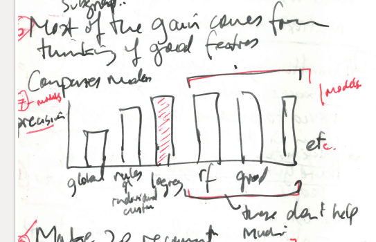
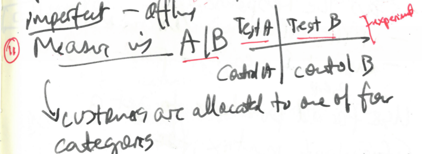

```{r setup, cache=FALSE, include=FALSE}
library(knitr)
library(tint)
knitr::opts_chunk$set(tidy = FALSE, cache.extra = packageVersion('tint'))
options(htmltools.dir.version = FALSE)
output <- opts_knit$get("rmarkdown.pandoc.to")
opts_chunk$set(warning=FALSE)
opts_chunk$set(message=FALSE)
opts_chunk$set(error=TRUE)
opts_chunk$set(cache=TRUE)
```

 
## How do we approach lists as objects of research? 


-----------------------------

```{r random_basket, echo=FALSE, cache=TRUE, fig.cap='Random basket'}
library(dplyr)
library(ggplot2)
library(readr)
library(knitr)
csvs = list.files('data', pattern = '*.csv',full.names=TRUE)
df = bind_rows(sapply(csvs, read_tsv))
kable(sample_n(df, size=5)$name, col.names='item', caption='Have you forgotten?')
```

---------------------------------------

> predictive analytics are discoveries of micrological propensities that are not directly correlated with human understanding and affectivity and that do not by themselves cohere into clearly identifiable events [@Hansen_2015a, 111-112]


>Whatever explanatory and causal value predictive analytics of large datasets have is, I suggest, ultimately rooted in this ontological transformation whereby probabilities are understood to be expressions of the actual propensity of things [@Hansen_2015a, 120] 


## 1. The context of the presentation: 'statistics and operations research in industry' 


-----------------------------------------------

```{r simulate_basket, echo=FALSE, cache=TRUE, fig.margin=FALSE, fig.cap='Prices and quantities of things in Tesco'}
library(dplyr)
library(ggplot2)
library(readr)
library(knitr)

csvs = list.files('data', pattern = '*.csv',full.names=TRUE)
df = bind_rows(sapply(csvs, read_tsv))

g = ggplot(df, aes(x=price,y=ContentsQuantity)) + geom_point(alpha=0.3, size=0.9 ) + theme(axis.text=element_text(size=10))  + xlab('Price (£)')
g + scale_x_log10() + geom_smooth()
```

--------------------------------------------------

```{r  simlate_basket_2, echo=FALSE, cache=TRUE, fig.margin=FALSE}
s = sample_n(df[df$price>=30,], size=20)
kable(s[, c('name','price')])
```


## 2. The web and the shopping basket: how it was reconstituted in the 1990s

 

------------------------------------


---------------------------

>Tesco is the clear winner in the online grocery market, in fact it takes almost 50p of every £1 spent on food shopping on the internet. [ https://econsultancy.com/blog/64841-how-seo-helps-tesco-to-dominate-the-online-grocery-market/ ]( https://econsultancy.com/blog/64841-how-seo-helps-tesco-to-dominate-the-online-grocery-market/ )

-------------------------------


----------------------------------------


----------------------------------------

> In everyday life, we rely on recommendations from other people. ... Recommender systems augment this natural social process. In a typical recommender  system, people provide recommendations as inputs, which the system then aggregates and directs to appropriate recipients. In some cases the primary transformation is in the aggregation; in others the system’s value lies in its ability to make good matches between the recommenders and those seeking recommendations.[@Resnick_1997,56] 

----------------------------------------


## 3. The rules-based list and the `apriori` algorithm


```{r arules, cache=TRUE, echo=FALSE, fig.margin=FALSE}
library(knitr)
library(arules)
library(arulesViz)
library(datasets)
data(Groceries)
itemFrequencyPlot(Groceries,topN=10,col=rainbow(10), ntype="absolute",  cex.axis = 0.55)
```

--------------

```{r arules_2, cache=TRUE, echo=FALSE}
options(digits=2)
rules<-apriori(data=Groceries, parameter=list(supp=0.001,conf = 0.15,minlen=2), appearance = list(default="rhs",lhs="whole milk"), control = list(verbose=F))
rules<-sort(rules, decreasing=TRUE,by="confidence")
inspect(rules[1:5]) 
```

----------------------------------------

> Multiplicity will be called  ‘closed’ when grasped by the numerical one, and ‘open’ when grasped by the vital One.  Every multiplicity is the joint effectuation of the closed and open, but its ‘veritable’ multiple-being lies on the side of the open. [@Badiou_2004, 72]

> A concept of the open is substantially established once we possess a multiple such that the we dwell within it by taking the intersection of two elements, or the union of many elements as we wish (even an infinity of elements). In the other words, the intersection of two opens is an open, and any union whatsoever of opens remains open. [@Badiou_2004, 73]

----------------------------------------

```{r tesco, echo=FALSE, cache=TRUE, fig.cap ='Tesco surplus',  fig.margin=FALSE}
    library(ggplot2)
    tesco = read.csv('data/reference_data/tesco_groceries.csv')
    total = sum(tesco$actual, na.rm=TRUE) 
    tesco = na.omit(tesco)
    tesco$actual = as.integer(tesco$actual)

    ggplot(tesco[tesco$actual>50,], aes(x=labels, y=actual, fill=labels)) +geom_bar(stat='identity') + coord_flip() + ggtitle('Tesco grocery items with more than 50 products') + theme(legend.position="none", axis.text=element_text(size=9))
```

## 4. Hack? Customers go straight to the checkout


## 5. 'We have 52 weeks of data for each customer': how is order constructed -- from history?

> This means, to put it slightly differently, that surrounding any delimited predictive system is a larger field of data -- what I elsewhere call a “surplus of sensibility” -- that, viewed speculatively, indexes the causal efficacy of the total situation within which this delimited system operates. (Effectively, the latter gains its reliability from closing off this larger surplus of sensibility, thereby transforming an always excessive propensity into a [provisionally] closed dataset.) Because it affords data that exceed whatever any given predictive system might include, the data of the world’s causal efficacy -- the data constituting its real potentiality -- always and in principle facilitates knowledge that cannot be restricted to any particular agenda [@Hansen_2015, 126-7]


## 6. Gain: use good features to build models 




## 7. Sparsity: output 20 recommendations from 200,000 products


```{r sparsity, echo=FALSE, cache=TRUE, fig.margin=FALSE, fig.cap ='The sparsity of predictions' }
library(ggplot2)
library(reshape2)
p = as.logical(rbinom(n=2e5, size=1, prob=0.001))
m = (matrix(p, nrow=1000, byrow=TRUE))

melted <- melt(m)
melted$value <- as.logical(melted$value)
ggplot(melted, aes(x = Var2, y = Var1, fill = value)) + geom_tile() +
    scale_fill_manual(values = c("grey", "black"))
 
```


## 10. Experimental settings: A/B allocation and uplift

 


## 11. Infrastructure: realtime engine serves up top 5


## 12. Similarity, substitution, complementarity and micrological propensities


-------------------------------------------------


```{r biscuits, echo=FALSE, cache=TRUE, fig.margin=FALSE}
    library(readr)
    library(knitr)
    bisc = read_tsv('data/biscuits.csv')
    kable(bisc[order(bisc$price, decreasing=TRUE)[1:30], c('name','price')])
```

 
## 13. Complementarity drives conversion 


## Conclusion


- the **constitutive incompleteness** and openness of lists are very closely entangled with problems of social order under predictive conditions
- shopping lists have complex temporal-material structure, since they mix prediction, infrastructural constraints, the individual characteristics of list-makers, statistical validations, database architectures and above all the **surplus sensibility** associated with  circulation of commodities.
- shopping lists undergoing a **conversion experience** as they become more probabilistic, but the idea that probabilities are the closed form of propensities does not account for the distribution of probabilities in relations between things, between people, between people and things, and between things and people.

--------------------------------------------
