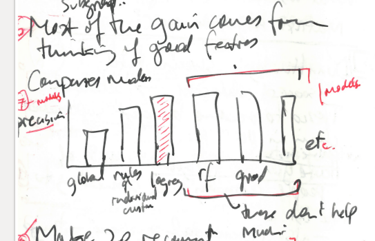

```{r setup2, cache=FALSE, include=FALSE}
library(knitr)
library(tint)
knitr::opts_chunk$set(tidy = FALSE, cache.extra = packageVersion('tint'))
options(htmltools.dir.version = FALSE)
output <- opts_knit$get("rmarkdown.pandoc.to")
opts_chunk$set(warning=FALSE)
opts_chunk$set(message=FALSE)
opts_chunk$set(echo=FALSE)
opts_chunk$set(error=FALSE)
opts_chunk$set(cache=TRUE)
```

# A.  Introduction

Big data practice often converts an existing state of affairs by adding a model or predictive elements based on the collection and analysis of data. This paper recounts the conversion of  an online grocery ordering system  from an older demographically-based recommendation system to a 'personal relevance' model. The main argument of the paper concerns how  personalization occurs in big data 'conversion events.' The term 'conversion event' has a dual sense. In recommender system design and web ecommerce, it refers to those occasions when a customer, user or site visitor clicks a specific hyperlink or purchases something. I also use it to refer to the common before-after narrative forms that proponents, developers and advocates of recommender systems adopt in describing, promoting, explaining or otherwise talking about big data, analytics or predictive modelling practices. In recent research and opinion on recommendations, personalization has been seen as the goal of predictive modelling.  Big data discourse in its promissory mode attributes potency to personalization: 'most important, using big data we hope to identify specific individuals rather than groups' [@Mayer-Schonberger_2013]. Conversely, current debates about the problems of big data emphasize the need to protect people from personalization.  Joseph Turow and co-authors conclude in their critical account of the transformation of retail space by business analytics: 'through it all, knowingly and not, and away from the spotlights of fierce social debate, retailers are encouraging daily routines that accept data-driven personalization as a centrifugal public' [@Turow_2015, 476]. Analysis of internet filter bubbles and the growth of predictive platforms in industry and government  [@Pariser_2011; @ONeil_2016a] also centre on personalization. In this paper, I agree that a transformation or conversion event is occurring, but one which also, even in the midst of much ongoing personalization,  opens the possibility of conceiving of social ordering processes afresh. Like Louise Amoore and Viola Piotukh's call for a new epistemology of population  [@Amoore_2015, 360], I will argue that contemporary recommender systems afford us the opportunity to re-conceptualise long-standing assumptions about social order and structure. The average everydayness and familiarity of the example here -- grocery shopping -- allows some first hand engagement with the messiness, the entanglements, and potentials of this conversion event in ways that other interesting settings -- social media for instance -- do not.

'Data-driven personalization' relies on predictions, themselves dependent on data practices ranging across acquisition, storage, transformation, exchange, integration, modelling and experimentation [@Goy_2007].  The reconstruction of an online grocery shopping recommender system and its  personalized predictions that I undertake here centres on the notion of probability and its role in modelling and experimentation.  Although probabilistic calculations of events have  long-standing importance in many settings (insurance, medicine, experimental and field sciences, operations research, risk analysis, engineering design, public health,  economic modelling, etc.), probabilities have taken on an altered operational function in digital platforms.  They have become mundane part of the weave of infrastructures, transactions, and practices found in everyday life. In order to take the _operational_ reality of probabilities into account, we might understand probabilities in quasi-physicalist terms  defined by the philosopher of science Karl Popper as a 'world of propensities, as an unfolding process of realizing possibilities and of unfolding new possibilities' [@Popper_1990,19]. This operational-physicalist or sociotechnical notion of probability shifts our understanding of data analytics, especially in association with platforms [@Gillespie_2010], away from personalization. It  draws  on Popper's re-framing of probability as propensity to  engage with grocery recommendations in their worldly enactments. 

The account is empirical in several respects. It departs from an ethnographic moment: being a member of the audience at an industry/academic conference where a data scientist was describing how personalized recommendations were created for online grocery orders.  The paper  draws on anthropological and sociological research concerning shopping and list-making to situate the recommender system amongst the social ordering practices of shopping and lists. It makes use of archaeological approaches, in the sense developed by Michel Foucault [@Foucault_1972] to identify and map functional statements and practices configuring the knowledge and order generated by such systems over time. It conducts several small-scale code-based experiments in order to reconstruct, using widely available code resources resources such as APIs (Application Programming Interfaces) and software libraries for machine learning, some prototypical elements of the system in question.  Like some recent work in science and technology studies,  anthropology and media studies [@Marres_2017; @Marcus_2014; @Bogost_2012], the paper is  shaped by practical encounter with the 'object' -- code, data, web platforms --  it describes. At times, this mode of empirical philosophy may seem overly fixated on the technical minutiae of algorithms and recommender systems and inattentive to lived experience or practices. With some forbearance on the part of readers, however, the argument of the paper should resonate sociologically. It concerns the relationality of social life, or the consistency and regularity of relating and acting in a world where probabilities and calculations based on probabilities are widespread.

# B. The conversion from demographic to personalized recommendation

At one of the many industry-meets-academia events occurring in data science-oriented higher education institutions in the UK, speakers from industry, government and commerce described their work with predictive models.[^11.1] Their narrative often followed the 'before-Big Data and after-Big data' conversion form.  Shreena Patel, a PhD graduate in statistics and operations research,  works as a data scientist for DunnHumby, a well-known [customer science company ](https://www.dunnhumby.com/) [@dunnhumby_2017].  Her work at DunnHumby focuses on online grocery shopping at the supermarket chain Tesco.  Speaking to an audience of statisticians and operations researchers, Patel focused on the development and operation of predictive models underlying  shopping list recommendations. The presentation was filled with graphs, numbers, and tables concerning ongoing development of the 'Have you forgotten?' recommender system.

[^11.1]: More than 100  Data Science Institutes have been set up in North America, Europe and UK since around 2012. The traffic between higher education and data analytics in industry is intense and flows in several forms: people funding, research findings, software and technical devices (code) and training.

Against the background of the sheer number of commodities and their distribution of prices, Patel's presentation presents two opportunities. First, by recounting, contextualising and commenting on the main steps in making the 'Have you forgotten?' list, we might follow some of the predictive sense-making done by data scientists and customer analytics teams working with transactional data in a typical commercial setting. Patel mentioned many of these steps only fleetingly in the presentation, for they are largely taken for granted as part of predictive analytic practice. Second, Patel focused on the renovation and updating of long-standing data-mining practice via a much more explicitly 'big data' and 'machine learning'-oriented implementation. Her presentation concerns a typical big data conversion event  in which a long-standing recommender system was replaced by a 'big data'-style system delivering 'personally relevant' recommendations.   What stands out from the presentation is not any state-of-the-art innovation, but the ongoing life of the recommender system: the new predictive model is part of a long-standing and ongoing transformation of grocery shopping. From a sociological standpoint, the interest lies less in specific technical innovations and more on how the ordering work done by recommender systems relates to the role of prediction in social order more generally.

# C. Shopping list orderings

Online grocery shopping at [Tesco](https://www.tesco.com/groceries/?icid=dchp_groceriesshopgroceries) includes recommendations for further grocery purchases under the title of 'Have you forgotten?'. When Tesco customers shop for groceries online, a list of five recommendations appear at the checkout stage. The recommendations are the product of a recommender system, an important category of operational device in big data (see for instance [@Hallinan_2014] for analysis of Netflix recommendation; [@Morris_2015]  or [@Seaver_2015] for an account of music recommendations).  The question 'Have you forgotten?' is followed by a list of some  grocery items that could have been or are usually on a shopping list. The title of the suggestions is a bit misleading. The recommender system, as we will see, is not concerned with forgetting, with the many slips and oversights associated to which shopping is prone,  but rather with substituting and adding items that customers had not selected perhaps because they had never thought of buying them in the first place. 

Grocery shopping is difficult to personalize. The anthropologist Daniel Miller has argued [@Miller_2012] that  shopping negotiates discrepancies between normative and actual social order (for instance, between the ideals of health emblematised by organic products and commitments to thrift embodied in lower cost generic products). Miller suggests that shopping practices attempt to resolve difference between how people think they should live and how they actually live: 'we have to watch how shopping helps resolve these discrepancies between the normative and the actual, but we also need some ideas of where the normative comes from in the first place' [@Miller_2012, 72]. More provocatively, Miller claims that 'shopping is largely a technology for the expression of love' (85). Whatever theory we have of how normative social order arises, Miller's argument  implies that shopping inhabits a mundane  but highly variable space between normative/idea and actual order. Importantly, and this will be a key consideration for the Tesco recommender systems, grocery shopping is not necessarily personal or individual. It  is saturated  by fluxing forms of social order concerning family and other forms of social grouping, and their associated relations (love, etc.). 

Shopping lists provisionally stabilise the complex social ordering of grocery shopping.  They provide important clues as to how local social order is constituted, maintained, and repaired in shopping. As people shop, either by  trawling along aisles packed with thousands of products, or scrolling down screens or searching for particular brands amidst search results, lists filter or reduce the excessive abundance, claims on attention, dazzle and distraction of commodities to the practicalities of domestic economy. The shopping list, whether written on the back of an envelope, saved as a list in an online grocery shopping system, or remembered, lies at the intersection of logistical flows, infrastructural orderings, and  lively negotiations around actual and normative social orders.[^30.1]  Shopping lists  are intersectional ordering devices that encapsulate a universe of possible references, and a teeming multitude of propensities with an actual local order.[^1.456]

[^30.1]: The shelves of large contemporary supermarket are the endpoint of global logistic supply chains, in all their logistical, value-transforming and brand-mediated hypercomplexity (see [@Neilson_2012; @Tsing_2009]).  Groceries imply a planetary geography of agriculture, industry, transport, communication and financialisation animated by flows of labour and capital. Encounters between this hyper-complex commodity-geography and people, even in the familiar confines of a supermarket, are no simple matter, either for shoppers or for supermarket operators such as Tesco.

Hand-written shopping lists have ongoing practical importance and mixed ordering practices (see the montage of handwritten shopping lists at [Grocery List](http://www.grocerylist.org)).  Online shopping lists, by contrast,  reside at the intersection of web and internet infrastructures, supply chain logistics, individualised practices and *habitus,* and increasingly, the predictive operations of  recommender systems. Whereas the aisles and shelves of a supermarket present a densely-woven mesh of objects competing for visual attention by offering distinctions of taste, thrift, expedience, novelty, indulgence, health, online shopping recommender systems generate lists that seek to align people to products that they otherwise might have little relation to (see [@Turow_2015] for an overview of the development of these systems). 

[^1.456]: If, as the social anthropologist Jack Goody argues, lists are historically primary as forms of writing in urbanizing cultures [@Goody_1986], and if list-making and its later variants (e.g. tables) precede discursive and narrative writing practices, then we might expect lists to function as powerful social ordering devices. More recent sociological work on lists (see [@deGoede_2016] for an overview) explore the social and political potency of lists as ordering devices. As literary scholars suggest (see [@Mainberger_2003]), even if lists have often been de-valued as literary forms, list-making commonly appears in literary form whenever writing seeks to address, name, group or evoke totality, profusion, excess or abundance. From both  anthropological and literary perspectives, shopping lists have excellent reasons to exist: they are deeply rooted in organisational life and infrastructures. Lists weave together people, infrastructures, things, and places.While lists intersect strongly with other meaning and sense-making practices in everyday life and popular culture, they can be refractory to discourse  and textual analysis methods built around models of language or speech, with its rules of syntax and grammar. On the one hand, lists are highly associative. They can be interpreted or decoded semiotically, although they exhibit  variations in textuality -- how they are written and read -- that thwart semiotic readings. On the other hand, as operational inscriptions, they can be treated ethnomethodologically, as the production of social order in a given setting. We might, in the light of their mutability, permeability and embedding in social order,  approach lists from various theoretical angles -- as asignifying semiotics as Maurizio Lazzarato calls it in his _Signs and Machines_ [@Lazzarato_2014] or as elements in 'a new order of spatio-temporal continuity for forms of economic, political and cultural life' as Celia Lury puts it in her account of topological turn [@Lury_2012].

# D. Archaeology of recommendations:  from 1984  to 2007

The main narrative of Patel's conversion narrative concerned the shift from a well-established loyalty-card based data-mining model developed in the 1990s to a predictive, probabilistic, 'personal relevance' model that would  append items to the shopping list in almost-realtime. While the changes Patel described are configured in Tesco-specific ways by DunnHumby, they are also broadly typical of a big data conversion event. Analytics service providers such as DunnHumby attempt to convert their customers by stories of conversion.[^6531] Patel's presentation was part of this effort. Tesco is the largest supermarket chain in UK and a notable success story for DunnHumby.  Tesco's  customer loyalty and targeted marketing programme known as 'Tesco Clubcard' started in 1991. DunnHumby -- founded by operations researchers Edwina Dunn and Clive Humby -- is said to have convinced the CEO of Tesco sometime in 1991 that a loyalty card program could change the supermarket chain's relationship to its customers.[^65.2]  Clive Humby's academic publications are hard to track down.   An early paper given at the _Conference of Young Operational Researchers_ in Nottingham in 1984 suggests the direction that he, the company Dunn and Humby formed (DunnHumby) and later Tesco would take in constructing lists [@OKeefe_1984]. The abstract for Humby's presentation pre-figures an ongoing trajectory for data mining techniques aimed at eliciting detailed information on individual customer references. 

[^6531] The web pages of the big data analytic companies providing products to various sectors of industry, government and media are stocked with images, graphics and statements centred on this conversion experience. [@Amoore_2015] analyses some of these. 

[^65.2]: Tesco changed its relations to customers in 1984 when they launched a very online grocery shopping system [@Winterman_2013]. 

```{r humby-1984, fig.cap = 'Abstract from a Clive Humby presentation (Humby,1984)'}
        
```

In  [@Humby_1989], Humby highlights the need to add lifestage data to neighbourhood data in marketing research. While Tesco  succeeded in data-mining its customers using demographic segmentation,  and perhaps became the UK's biggest supermarket with the help of data-mining in the 1990s, the shopping environment  in 2017 is markedly different [@Turow_2017]. It is no longer organised around campaigns involving special offers or redemption of points for demographically segmented loyal customers (DunnHumby made heavy use of UK Census data). It can no longer rely on placement of goods in carefully chosen locations in stores. It needs, or at least might want to, up-sell and cross-sell to customers who only sometimes visit the supermarket itself.

How could we characterise the shift from ClubCard data mining to online grocery markets?  If 'Tesco is the clear winner in the online grocery market, in fact it takes almost 50p of every £1 spent on food shopping on the internet' [@Silverwood-Cope_2014], then has Tesco itself undergone some kind of conversion? Patel described her work at DunnHumby as converting the recommender system from a 'rules-based list' to a 'relevance model.' The relevance model affected the construction of the 'Have You Forgotten' list.   This very localised intervention is typical of broader re-organisation of prediction. The shift in models results in a more probabilistic structuring of lists.  As is so often the case in big data conversion narratives, the triviality of the 'Have you forgotten?' recommendations provides only peripheral signs of the complex predictive infrastructure underpinning them.

Academic researchers first began writing about personalized recommender systems in the mid-1990s. From the outset they highlighted a potential shift from demographic-driven market research or data mining techniques to personalized recommendations. For instance, writing in 1997 in a special section of the _Communications of the ACM_ on recommender systems, Paul Resnick and Hal Varian (at that time Dean of Information Sciences at UC Berkeley, but currently Chief Economist at Google), made much of this personalization [@Resnick_1997]. Resnick and Varian  emphasised the need to distinguish the emerging practices from data mining:

>In everyday life, we rely on recommendations from other people. ... Recommender systems augment this natural social process. In a typical recommender  system, people provide recommendations as inputs, which the system then aggregates and directs to appropriate recipients. In some cases the primary transformation is in the aggregation; in others the system’s value lies in its ability to make good matches between the recommenders and those seeking recommendations.[@Resnick_1997,56]

Writing just after the advent of web-based e-Commerce, Resnick and Varian  imagined recommender systems drawing on  the 'collaborative filtering' that people do when they write and read reviews of products and services (for instance, on the travel website, TripAdvisor; [@Scott_2012]). In 1997,  Resnick and Varian expected that 'people [would] provide recommendations' and recommender systems would aggregate and rank recommendations for recipients. A slightly later review, [@Schafer_2001], diagrams an augmented 'natural social process' with a range of elements, technologies, inputs and outputs, with varying degrees of personalization.

# E. Probabilistic conversion events

Given personalized recommendations stretch back two decades, what in  the newly implemented  recommender system changes?  The components of the new recommender system -- predictive models and their parameters, infrastructural provisioning to run the models, product similarity matrices --  address the challenges of personally-relevant recommendations -- too many products, changes over time, unstable propensities of things in their associations with people. The 'personal relevance model' and personalization more generally have a troubled relation to a social order because it is, as grocery shopping attests, intrinsically social. The model will need to render grocery shopping calculable in a way that somehow includes the associated social ordering and negotiation. The model, like many big data practices, predicates probabilities as a way to render the situation calculable.

From the standpoint of probability, recommendations are conditional probabilities or probabilities whose calculation takes into the account the occurrence of other events. But what is a probability today? In exploring Patel's account of the recommender system, my focus probabilities seeks to re-frame the operation of the recommender system in a way freed from lingering incompatibilities between calculation and social life [@Dewey_1957, 26]. In order to re-frame probability, I draw directly on the work of Karl Popper. In an essay written towards the end of his career, Popper presents a non-standard account of probabilities as real processes. He argues that probabilities have a physical reality equivalent to forces and fields [@Popper_1990]. Against standard interpretations,  Popper does not identify probabilities with either degree of belief (likelihood) or frequency of events. Instead he suggests 'they should be regarded as _inherent in a situation_ ' [@Popper_1990, 14].  In his account, probabilities are tendencies towards realization inherent in a situation. Probabilities have or indeed are _propensities_, tendencies to realize the event (11). While Popper's concept  of probability as propensity might seem remote from the concerns of online grocery shopping, it applies quite well to Patel's presentation of the personal relevance model and the ways in which it seeks to calculate probabilities of purchase. The reconstructions of the model I am about to discuss will explore the implications of this alternative account of probability for regular narratives of personalization.[^65.1]

[^65.1]: The media theorist Mark Hansen has recently applied Popper's account to argue  that 'predictive analytics are discoveries of micrological propensities that are not directly correlated with human understanding and affectivity and that do not by themselves cohere into clearly identifiable events' [@Hansen_2015a, 111-112]. Hansen's account differs from many widely shared views of big data. In the face of the so much personalization (and Patel's presentation exemplifies this), Hansen attributes a somewhat impersonalizing force to big data.  If  much predictive practice attempts to elicit 'micrological propensities' from data, Hansen links data to things via probabilities: 'whatever explanatory and causal value predictive analytics of large datasets have is, I suggest, ultimately rooted in this ontological transformation whereby probabilities are understood to be expressions of the actual propensity of things' [@Hansen_2015a, 120]. Hansen theorises big data or predictive analytics as an 'ontological transformation' that deploys probabilities in an evermore closely woven and encompassing expression of animated, eventful, propensities of things. Predictive analytics links probabilities as calculations to propensities or the mutable associative agencies of things. The practical and indeed empirical  question is whether such transformations or 'conversion' in relations between probabilities and 'the propensities of things'  can be detected and articulated in the prosaic setting of shopping lists and recommender systems. 'Conversion' is a preferable term for these changes. Not much hinges on the choice of terms, but 'conversion' happens to be the term used by Patel.  It highlights  re-orientations in subjects, experience, things, numbers and infrastructures that ranges more widely and are more grounded than Hansen's 'ontological transformation' formulation.

## `Apriori` conditional probabilities

Probability has been difficult to work with philosophically according to Popper because  dice rolls, coin tosses, urns with balls and other seemingly random events have occupied centre stage. Even dice-rolling and coin-tossing has been enormously productive and transformative in scientific thought and practice, it privileges _absolute_ probability at the expense of _conditional_ probabilities. 'We need,' Popper urges, '_a calculus of relative or conditional probabilities_ as opposed to _a calculus of absolute probabilities_' [@Popper_1990, 16]. Relative or conditional probabilities are propensities that depend on other events for their own realization. All events require other events, so all probabilities are conditional, even if probability calculations typically abstract or ignore the inevitable physical conditioning of their realization.

Viewed from the standpoint of probabilities, predictive systems are highly crafted arrangements for the calculation of conditional probabilities. For instance, the first element of the new recommender system consisted in a change of the underpinning algorithms and model. Patel described  move away from 'a rules-based system'. It is likely that what Patel describes as  the 'rules-based system' refers  to the extremely well-known association rules or `apriori` algorithm  learning technique, developed  by computer scientists Rakesh Agrawal and Ramakrishnan Srikanti working at IBM Research Alameda in the early 1990s [@Agrawal_1994]. A now-classic approach to 'market basket analysis,' it was listed as one of the top ten data mining algorithms in a survey conducted amongst data miners [@Wu_2008] and usually attracts a chapter in data-mining and machine learning textbooks (e.g. [@Hastie_2009]). The interest of `apriori` for our purposes is that it begins to address the problem of understanding large numbers of shopping transactions as a matter of conditional probability.

```{r arules-ex, cache=TRUE, fig.cap='Frequency of items in the `Grocery` dataset', message=FALSE, echo=FALSE, fig.margin=TRUE}
library(knitr)
library(arules)
library(arulesViz)
library(datasets)
data(Groceries)
itemFrequencyPlot(Groceries,topN=10,col=rainbow(10), ntype="absolute",  cex.axis = 0.55)
```

The notion of conditional probability at work in `aprior` is relatively simple, and assumes that the frequency of transactions provides the best guide to what shoppers are likely to buy. The `apriori` algorithm finds sets of items that commonly occur together in transactions. In this sense, is still oriented by a notion of absolute probability, inflected by some elements of conditional probability.   Commonly occurring sets are expressed as 'association rules.' For instance, applied to a dataset of generic, unbranded grocery purchases, the `apriori` algorithm counts frequencies of purchase in the overall set of all items purchased in a supermarket (the `Groceries` dataset  was acquired from a 'local German supermarket' [@Hahsler_2006]). Figure \@ref(fig:arules-ex) shows how often the most common items appear. `Whole milk` appears most frequently.

```{r arules-ex2, echo=FALSE}
options(digits=2)
rules<- apriori(data=Groceries, parameter=list(supp=0.001,conf = 0.15,minlen=2), appearance = list(default="rhs",lhs="whole milk"), control = list(verbose=FALSE))
rules_sorted <- sort(rules, decreasing=TRUE,by="confidence")
kable(inspect(rules_sorted[1:5]), caption='The first five association rules for the `Groceries` dataset')
```

The association rule-based model for the `Groceries` dataset illustrates some characteristic ordering practices of 1990s-style data-mining approaches to lists. The association between items is expressed in the form of _rules_ whose importance is can be ranked by how frequently items are found in the same purchase. Although the `apriori` model does not use the language of probability calculus, the 'rules,' a term derived from older decision support literature, rank associations between items.  The resulting set of rules (shown in Table \@ref(tab:arules-ex2)) indicates that milk and vegetables has a stronger association than milk and buns.  The calculations of `support` (how frequently the association appears in the dataset), `confidence` (how often the rule applies in the dataset)  and   `lift` (a ratio between the `support` and the independent frequencies of the items) in the table attempt to measure the strength of these associations in different ways.

## 2500 sauces: `Apriori` meets the API

Even as `apriori`  expresses associations between things as relative probabilities, it struggles with the propensity of commodities to multiply, especially in supermarkets and grocery shopping. A simple illustration of the combinatorial problem faced by recommender system can be drawn by bringing the `Grocery` dataset together with the actual list of items that Tesco sells online.  If we take all the items in the `Grocery` dataset and paste them into the 'shopping list' box on the Tesco grocery website (or as I did, run them as searches on the TescoLab Product API [@Tesco_2016]), each of the 169 generic items in the `Grocery` dataset yields dozens and sometimes thousands of products in the Tesco inventory.

```{r tesco-ex, echo=FALSE, cache=TRUE, fig.cap ='Tesco grocery items with more than 50 products',  fig.margin=TRUE}
    library(ggplot2)
    library(dplyr)
    library(svglite)
    tesco = read.csv('data/reference_data/tesco_groceries.csv')
    total = sum(tesco$actual, na.rm=TRUE)
    tesco = na.omit(tesco)
    tesco$actual = as.integer(tesco$actual)
    tesco_cropped <- tesco %>% select(actual, labels) %>% arrange(desc(actual)) %>% filter(actual> 50) %>%
            mutate(labels = factor(labels, levels = labels[order(-actual)])) 
    ggplot(tesco_cropped,
        aes(x=labels, y=actual, fill=labels)) +
        geom_bar(stat='identity') + coord_flip() +
        xlab('Item count') + ylab('Grocery item') +
        theme(legend.position="none", axis.text=element_text(size=6))

    ggsave('figure/tesco_grocery_lines.svg')
    ggsave('figure/tesco_grocery_lines.png')
```

Items in the `Groceries` dataset proliferate into a Tesco's list of branded products. The 169 items of the `Groceries` dataset  expand into roughly `r total` Tesco items (see Figure \@ref(fig:tesco-ex)).  Recommender systems confront, I would suggest, a logistical proliferation of commodities. The association rules derived  from  the `Grocery` dataset becomes more open to identifying sets of items that have only low association with each other.  Given almost 2500 `sauces` and 1200 `rice` products listed by the Tesco API,  a tremendous number of associations between sauce and rice are possible. The propensities of any given sauce and rice product to find themselves together in a shopping basket greatly. The proliferation of things on the shelves of supermarket or grocery warehouse produces a combinatorial problem for data-mining machine learning approaches such as association rules. `r total` products (actually Patel mentioned 200,000 products) can be combined in a many ways. If a typical shopping list has 20 items, then there are `r format(choose(total, 20), 2)` possible lists. Most possible shopping lists have propensities or tendencies to realization expressed as probabilities close to zero. Others with somewhat higher propensities might furnish the basis of interesting recommendations.

More importantly, association rules limit the conditioning of probabilities to counting frequency of co-occurrence of items in shopping baskets.    Even if the association rules provide recommendable sets of frequency-weighted associations, an `apriori`-based recommender system has no way of individualising its recommendations. Its probabilisation of shopping is incomplete since it only works on associations between things. The tendency of some milk to find itself in a shopping basket alongside bread attests to an ordinary propensity in certain parts of the world. The conditional probabilities implicit in the association rules  do not, however, include much of the world.  These associations are not trivial, but they are very open-ended. Put in terms of Popper's account of probability as propensity, the rules-based system has, in principle, limited means of crystallizing a limited or enclosed set of possibilities.[^135.1]

[^135.1]: The fact that DunnHumby and Tesco use demographic data derived from government census and other sources to differentiate association rules does not significantly overcome this limitation. 

## The list as relational field

Predictive models have become central technical elements in many big data conversion events because they offer a way of operationally calculating probabilities that incorporate some of the propensities -- to purchase a magnum of French champagne for instance -- inherent in situations. In the new recommender system described by Patel, the business goal is to extend the list of the items customers have selected for purchase with  a few recommended items. In order to do this, the list of items selected for purchase will be extended by recommendations that have, according to a predictive model, the most chance of 'conversion' or actual purchase. Most recommender system designers assume that modelling 'personal relevance' is the best way to do this. The predictive model carries the burden of calculating the conditional probability of purchase given everything known about the person at a given moment in time.

```{r models, fig.cap='Precision measurements for different machine learning models'}

```

Patel introduced the new 'personal relevance model' with a data graphic familiar to machine learners and statistical modellers. (A sketch of her graph appears in Figure \@ref(fig:models).)   Patel assumed that the audience understood the working of the logistic regression model, and the bulk of her presentation concerned the obstacles and problems that arise in trying to personalize recommendations in ways that lead to the much-desired 'conversion events' or sales.  The graph plots the _precision_ -- the proportion of the recommended products that customers actually purchase -- for several different statistical models.  The graph indexes the 'causal efficacy' of the recommender system, its capacity to include and transform propensities or 'real potentialities' into operational events or purchases. Patel used the graph to compare the previous rule-based recommender systems with some of the 'personal relevance model' alternatives -- logistic regression, random forests, gradient boosting and a few others -- in terms of their predictions and how those predictions turned out. Patel dismissed most of the models quite quickly and focused only on one, the logistic regression model, which did as well or slight other than other alternatives.

The models Patel mentioned are all 'classifiers,' predictive models that 'classify' particular outcomes by calculating their probability of membership of some class of outcome.  Much of the core architecture of the machine learning classifiers received glancing reference in Patel's presentation. In DunnHumby's work, the classifier at the heart of the recommender system calculates for a given customer the most likely products to be purchased.  The predicted classes are binary: `recommended` or `not recommended.` Products are allocated to one of these classes depending on their calculated probability. A probability greater than `0.5` typically would be `recommended.`  The logistic regression model generates probabilities of purchase for each product for each customer. The fundamental  shift  here is that the classifier model extends the reach of  the recommendations generated for a customer to not only  the 250,000 items in the Tesco inventory but to any item, relationship, similarity or event that can be constructed as a variable in the classifier model. In this sense, the recommendations shown to a customer in the 'Have You Forgotten' list derive from an intricate conditional probability statement, woven from, as we will soon see, an open-ended field of relations.

## Repeating sufficiently often to matter

I will not discuss all the dimensions of probabilisation implicit in the architecture of the new model but highlight those elements that trouble the notion of 'personal relevance' and personalization more generally. These include the problem of repetition and temporality of calculation,  experiments on the platform,  and attempts to create new views of the data.      

One fundamental difficulty is that the propensity of a customer to buy a recommended product changes. Popper's notion of probabilities as tendencies to realization inherent in a situation implies this.  As Popper observes, 'the propensities cannot be measured because the relevant situation changes and cannot be repeated' [@Popper_1990, 17]. Measuring propensities and expressing these measurements as numbers between `0` and `1` becomes difficult because as a situation changes,  the propensities themselves change. No doubt the contingencies associated with grocery shopping are legion, perhaps more so than other kinds of products (books, music, films),  and any attempt to measure propensities associated with particular commodities  will encounter many changes.

One way in which recommender systems attempt to address the problem of the relational dynamics of propensities is by assuming that purchases will be repeated.   Patel mentioned that the new model uses  '52 weeks of data' for each customer. In including this data in the model, the assumption is that the probability that a specific customer will buy a specific product will be increased by previous purchases of that product. The history of previous purchases constitutes forms of repetition that imply a stabilisation of propensities (high or low; e.g. a vegan customer will never have purchased chicken products, so the measured propensities for any of the 1000 or so chicken products sold be Tesco will remain close to `0`). But the changing situation of the customer only figures here in the accumulated year of purchase data.     

When the logistic regression model includes the 52 weeks of previous purchases, the conditional probability calculation undertaken by the recommender system ramifies tremendously in several respects. Potentially, each of Tesco's 200,000 products becomes a variable in the classifier. We can imagine this as an arithmetic sum extending along a series of 200,000 terms.   Practically, most of the these variables will only slightly influence the sum of the probabilities for recommendations since most customers will have purchased only a fraction of the inventory. As Patel observed,  again assuming that this would be obvious to the audience of data scientists,  'we have lots of zeros'.   A matrix that records associations between individual people and products is bound to be mostly empty. Say Tesco has 1 million online customers. Each online  shopper has bought some selection of the 200,000 products. The customer-product data matrix will be `r format(1e6 * 2e5)` in size.  The product-customer matrix, the basic vector-space in which all recommender systems operate, remains very sparse and unpopulated. Given that any one customer is likely to only have bought 100 or so different products, the  matrix contain  `r format(100-(100/2e5)*100, 2)`% zero probabilities.

Any dataset where the items of interest are much rarer than other values is said to be 'unbalanced.' The purchase history data is, as Patel put it, 'massively unbalanced,' and imbalance heavily biases the model towards common and somewhat impersonal suggestions, suggestions that might  not produce the desired conversion experience for either the individual customer or DunnHumby's renovation of Tesco's recommender system. Since so many people buy milk, the recommendation system might end up always recommending milk. So the data needs to be 'corrected' by, as Patel reports, removing -- 'under-sampling' -- some of the data for common purchases. 'Having all the data,' one of the anchoring claims of big data conversion narratives, also creates the need to delete some data.     

The problem of repetition, the fact that situations change and therefore propensities change too, is known to designers of recommender systems. But they do not have the ideal conditions envisaged in probability theory (unbiased coins, flipped any number of times).  The model's own operation as a data-intensive calculation need to be adjusted to the scale of values of grocery retail, to the available computational, database and network infrastructures, and to the capacities of the online grocery system to inject recommendations into the flow of grocery orders in a timely fashion.  While raw data from Tesco Online transactions  feeds into the model's dataset  every hour, a recommendation list for each customer is only generated once a week. Customers shop online every few days at the most, and in some cases, only every few weeks. To update the top 200 recommendations for several millions customers  demands much computation. Patel briefly mentioned  specific infrastructural elements such as `hadoop` [@ApacheSoftwareFoundation_2009].

The possibility of adjusting the recommendations for each customer every week depends on an infrastructure capable of collecting data, and assimilating that data in a predictive model.  'Personal relevance' depends on a matrix of probabilities of associations between people and things that shifts in time.  `Hadoop` and its legion of 'big data' variants (`mahout`, `spark`, `hive`, `pig`, `yarn`) operationalise repetition at an infrastructural rather than analytic scale. Patel's quick gloss of the infrastructural deployment of DunnHumby's relevance model is  primary to the conversion event: the logistic regression model at the heart of the recommender system is no longer an analytical device but an operational one because it seeks to revise recommendations as situations change.

## Platform experiments reduce interfering propensities

In his account of probabilities as physical propensities, Popper emphasises why laboratory experiments are important to probability:

> experiments work ... by creating, at will, artificial conditions that either exclude, or reduce to zero, all the interfering and disturbing propensities [@Popper_1990,23].

Like the accounts of laboratory practice provided by science studies [@Latour_1986;  @Lynch_1993], Popper understands experiments as stabilizing the conditions so that probabilities become less variable. Experiments play an important role in conversion events, or in the process of bring new predictive models to bear on shopping practice. A crucial consideration for  a recommender system designer will be how to experimentalize the systems recommendations so that they are not disturbed by other propensities. This is an inordinately difficult challenge, since, as we have seen, grocery shopping takes place at the intersection of normative and actual social orders, individual and group belongings, and logistically global economic processes. 

|Test A|Test B|
|------|------|
|Control A|Control B|
|---------------------

Experimentalization, the practice of creating conditions that reduce disturbing propensities, runs deep in the conversion event.  The predictions of the recommender system themselves are the subject of experiment. Patel described the deployment of  the personal relevance model in a random A/B controlled trial on the Tesco website. All customers were  allocated to one of four categories as shown in  table. In the  A/B testing,  customers  receive recommendations from different models (the old recommender systems vs. the new one; a logistic regression model vs. a random forest model, etc.).   The randomised application of  competing predictive models, draws on protocols for randomised clinical trials first developed in the 1960's, and is widely used in social media platforms and hence in the implementation and observation of the effects of recommender systems.[^238.1] Random allocation of customers to the four categories (Test A, Test B, Control A, Control B) adds a layer of probability to the recommender system in the name of statistical validation of the effects or the 'uplift' of the model.[^122] Ironically,  the effects of a predictive model cannot be known in advance. They can only be observed experimentally.

[^238.1]: It is difficult to gauge how much. Facebook reports that it has more than 1 million models operating in its infrastructure [@Dunn_2016].[@Christian_2012] provides information on the extent of A/B testing in web and social media. 

Random allocation of customers to control and test groups occurs without taking individual propensities into account.  A/B testing  seeks to statistically validate effects -- the *uplift* -- of the model on  conversion rates by directly measuring the effects of the model on what people do.  The uplift refers to conversion events associated with the same groups of people. Effectively an experiment in creating micrologically different worlds, the randomised control trial  sets up a control mechanism that connects  the predictive model (the logistic regression), and the conversion event more broadly. Without this experimental connection, the conversion event narrative lacks grounding in a state of affairs in the world. 

[^122]: See [@Lo_2002] for an introduction to the construction of experimental set ups for uplift models in marketing research. Market researchers and data miners seem to have started adopting a statistically-grounded experimental predictive practice around 2000. See for instance [@Almquist_2001]  Response modelling, 'propensity' modelling and uplift modelling all seek to identify associations between 'treatments' or interventions and the 'Responders', the people  affected by the treatment.

## The openness of the data: new features

Whatever disturbing factors or interferences the experimental trials of different predictive models reduce, another stream of propensities runs away from the goal of personal relevance. Popper suggest that the realization of tendencies is open-ended:

>What may happen in the future ... is, to some extent, open. There are many possibilities trying to realize themselves, but few of them have a very high propensity, given the initial conditions [@Popper_1990, 22].

There are different ways of reading this statement. We can read Popper as stating a truism,  an obvious consequence of his physicalist understanding of probabilities as tendencies inherent in a situation: anything can happen in the future. An alternative, perhaps more interesting reading  focuses on the pivotal phrase: 'possibilities trying to realize themselves.' What might 'trying to realize' mean in practice? DunnHumby's work on the personal relevance model, and much big data practice in general, presents just such a 'trying to realize' in practice. 

Several times in her presentation, Patel emphasized the importance of 'good features' in the data, and much of her presentation concerned DunnHumby's efforts to construct 'good features.' A 'feature' in the context of machine learning and predictve modelling refers to a variable included in a predictive model [@Domingos_2012]. A 'good feature' contributes to the accuracy, precision, specificity or any of the other measures of prediction applied to machine learning models in practice. The construction of 'good features', however, remains open to many different possibilities, some of which are more practically feasible than others, and some of which are more aligned with personal relevance than others.

The main efforts that DunnHumby made to  construct good features were not closely focused on individuals  but sought to include  relations between things in the predictive model. Patel, for instance, described the problem of 'basket similarity.' The recommender system should not recommend items that are too similar to groceries already in a customer's basket. A customer might be willing to substitute a similar item for something they have already chosen, but they are more likely to accept a recommendation that complements already selected items. How could the recommender system avoid similiarities and  prefer complementaries between things for a given customer, especially since a person's sensibilities and susceptibilities concerning similarity and complementarity are shaped by social groups, orderings and circumstances? A predictive model could only do that if it had some sense of the relation between items already in the list and the products elsewhere.

The 'personal relevance' model sought to include the similarities and complementarities between items. The DunnyHumby data scientists constructed a new feature from the previous purchase data measuring substitutability and complementarity between products.  Taking all the baskets of items purchased on the basis of recommendations, they derived a  new feature, what DunnyHumby termed 'self-learning substitutes.' Added to the relevance model, the 'self learning substitutes' feature adds another data matrix, the product similarity matrix, itself generated from all previous recommendations that have led to conversion events (that is, 'a user clicked as the response').  The self-learning substitutes feature is complex. Patel mentioned that it took the form of a 'design matrix of 14,000 columns.' 14,000 new explanatory variables were added to the logistic regression model.  Recommendation would be subtly re-weighted by this complex derived feature.[^215]

[^215]: The proliferation of variables or features in the model itself introduces new instabilities, new 'possibilities trying to realize themselves' and the DunnyHumby data scientists used  '`L1 regularization` to drive coefficients down to zero', or, put more simply, to exclude variables there were not contributing much to the predictions produced by the model. Even this added feature does not exhaust DunnHumby's attempts to re-shape the recommender system. They were just beginning, Patel reported, to model complementarities between things. `Nutella` complements `bananas,` but the converse is not necessarily true since `bananas` need not complement `nutella,` especially if I have nut allergies.  From the standpoint of customer data science, Patel emphasised the operational significance of predicting complementarities:  'complementarity drives conversion.' 

# F. Conclusion

The personalization of recommendations has been a distinctive feature of big data conversion narratives and practice. The Tesco recommender system, starting from its early experiments with demographic data-mining, its later adoption of a rule-based 'market basket' analysis system, and its recent implementation of a machine learning 'personal relevance model' follows the trajectory of personalization.  Its recent big data conversion event largely takes the form of personalization. Individualizing personalization, however,  is ill-fit to the socially complex negotiations of grocery shopping, and tends to obscure other implications.  Conversion events,  in both the sense of the purchases made on the basis of recommendation and the narratives of changes in modelling practice related by data scientists do not easily map to personalization. They include relations running between people and things in time. They include an ongoing process of adjusting, scaffolding, intervening and configuring orders. Only because grocery shopping is  personally pre-ordered by lists can a predictive recommendation, provisionally conducive to new conversion events, gain traction.  

In the context of recommender systems, the constitutive incompleteness of shopping lists and their propensity to expand or change might be more important than their capacity to be personalized. I suggest that we might understand what precedes and exceeds personalization as probabilization. The framing of this conversion as a 'flat difference of degree, such that it appears as though everything is calculable' [@Amoore_2015, 361] risks misunderstanding the different propensities tending to realization.   If, as Popper argues, a propensity-based account of probabilities 'amounts to generalizing and extending the idea of forces again' [@Popper_1990,14], then we should see the compute  platforms, databases, software libraries, web interfaces and global supply chain logistics as part of this conversion event, as  tendencies or propensities in  the process of realization. When we track what is practically done to construct a personal relevance model and apply it to a shopping list, we see conditional probabilities assembled in predictive models, but also in the rhythms of  platform and infrastructural configurations and experiments that gather and process data,  and in the open-ended construction of features in data. In various ways, these tendencies shift and complicate the  associations between people and things, people and people, and things with things. They cut across boundaries between the personal and impersonal.  If social order is made of propensities to associate, if to be social is a propensity to associate, then big data conversion events operationalize association in matrices of propensity.

# References
